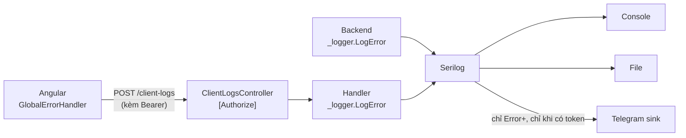

# Bắn lỗi production về Telegram (backend + frontend)

**Ngày:** 2026-08-11
**Nguồn:** thuận theo `p12-slice-1-2-telegram-error-logging.md` của dự án co-356 (đã ship 2026-06-04 ở đó).
**Tầng chạm:** Api (Serilog + controller) → Application (command) → Frontend
**ADR:** không cần — thêm một sink Serilog và một endpoint là **mở rộng** pattern sẵn có, không đổi schema, không đổi contract cross-layer, gỡ ra chỉ cần xoá controller + khối config.

## Thuật ngữ

| Viết tắt | Tên đầy đủ | Nghĩa ở đây |
|---|---|---|
| sink | — | Đích ghi log của Serilog (Console, File, và nay là Telegram) |
| enricher | — | Thành phần bơm thêm thuộc tính vào mỗi dòng log (userId, đường dẫn) |
| relay endpoint | — | `POST /api/v1/client-logs` — frontend đẩy lỗi về đây, backend mới gọi Telegram |
| PII | Personally Identifiable Information | Dữ liệu nhận dạng cá nhân |
| ICT | Indochina Time | Giờ Việt Nam, UTC+7 |

## Vì sao không bê nguyên tài liệu co-356

Bảy điểm lệch. **Ba cái đầu bê nguyên là hỏng**, không phải chỉ khác về thẩm mỹ.

| # | co-356 | Ở đây | Hậu quả nếu bê nguyên |
|---|---|---|---|
| 1 | `appsettings` để `"BotToken": ""`, guard `IsNullOrWhiteSpace` | Quy ước dự án là placeholder `{Telegram__BotToken}` | Placeholder **không rỗng** ⇒ guard không chặn ⇒ sink đăng ký rồi gọi Telegram bằng chuỗi `{Telegram__BotToken}` làm token, **fail mọi lần**, im lặng |
| 2 | Sửa `auth.interceptor.ts` thêm `/client-logs` vào skip-list chống lặp 401 | Dự án này **không có** global auth interceptor — service tự gắn header | Sửa một file không tồn tại; và quên rằng `ErrorLoggerService` phải **tự** gắn `Authorization`, nếu không thì 401 vĩnh viễn |
| 3 | `TenantIdEnricher` đọc claim `tenantId` | App **một người dùng**, không có tenant | Mọi tin nhắn hiện `Tenant: —`, một dòng rác vĩnh viễn; thay bằng `UserId` mới có ích |
| 4 | Đăng ký `ErrorHandler` trong `app.config.ts` | Không có file đó — bootstrap ở `main.ts` | Không tìm thấy chỗ đăng ký |
| 5 | Cổng Playwright `slice-1-2-telegram.spec.ts` | Dự án không dùng Playwright | Bỏ; thay bằng Karma + `/qa-verify` (chrome-devtools) |
| 6 | Blocklist PII: `customerPhone`, `customerName` | Miền khác: email, giá trị danh mục, mã + khối lượng vị thế | Chặn nhầm thứ, bỏ lọt thứ thật sự nhạy cảm |
| 7 | Repo private, ghi "fingerprint ChatId (4 số cuối)" vào `infra-setup.md` | Repo **PUBLIC** | Không commit cả fingerprint; và dự án này không có `infra-setup.md` |

Bản checkpoint của co-356 cũng đã học được vài thứ mà phần thân tài liệu chưa sửa — dùng luôn:

- Gói `Serilog.Sinks.Telegram` gốc đã chết; dùng **`Serilog.Sinks.Telegram.Alternative`**, tham số là `batchSizeLimit` chứ không phải `batchPostingLimit`.
- `IHttpContextAccessor` phải đăng ký **trước** `UseSerilog(...)` để enricher resolve được.
- Regex che dữ liệu phía frontend **phải có cờ `g`** — thiếu là chỉ thay được lần khớp đầu tiên.
- Blocklist cần thêm `token`/`secret` để chặn ca lỡ dump header `Authorization`.

## Phạm vi

**Có:** lỗi mức `Error`/`Fatal` ở backend, và lỗi chưa bắt ở frontend, đi về một kênh Telegram riêng tư trong ~15 giây.

**Không:**
- Không đụng `AlertEvaluationService` (cảnh báo giá cho **người dùng** — việc khác hẳn).
- Không cài phần cảnh báo lệch hợp đồng của [`p1-provider-fail-loudly.md`](../p1-provider-fail-loudly.md). Việc đó vẫn ở mức `Warning` nên **không** lọt vào Telegram; nối nó vào là bước riêng, sau khi đo được mức ồn.
- Không dedup/rate-limit ở tầng ứng dụng — `batchSizeLimit` + `period` của sink là đủ cho một app một người dùng.
- Không tự động che PII bằng regex ở backend; chặn bằng blocklist tên trường + quy ước chỉ log ID.

## Thiết kế



Một đường ống, hai nguồn lỗi, một hộp thư.

Frontend **không** gọi Telegram trực tiếp: bot token sẽ nằm trong bundle JS mà ai cũng đọc được.

## Bước 1 — Relay endpoint (TDD)

`POST /api/v1/client-logs`, `[Authorize]`, trả 200 rỗng.

**Test trước** (`InvestmentApp.Application.Tests/ClientLogs/`):

| # | Ca | Mong đợi |
|---|---|---|
| 1 | `Message` rỗng | ValidationException |
| 2 | `Message` chứa `email` / `password` / `token` | ValidationException, câu tiếng Việt |
| 3 | `Url` chứa chuỗi giống email | ValidationException |
| 4 | `Stack` dài 2000 ký tự | Handler cắt còn đúng 1000 **trước khi** log |
| 5 | `Stack` null | Vẫn log được, không NRE |
| 6 | Payload hợp lệ | `LogError` gọi đúng một lần, template dùng placeholder có tên |

⚠️ Ca 4 phải khẳng định **độ dài chuỗi thật sự được log**, không phải chỉ khẳng định "không ném". Khẳng định `NotThrow` là loại rỗng ruột đã cắn ở chỗ khác.

Giới hạn: `Message` ≤ 500, `Url` ≤ 500, `Stack` ≤ 1000, `UserAgent` ≤ 200, `Context` ≤ 100.

## Bước 2 — Enricher + formatter

| File | Việc |
|---|---|
| `Logging/UserIdEnricher.cs` | Đọc claim `sub` từ `IHttpContextAccessor`; mặc định `—`. Bọc try/catch — **đường log không bao giờ được ném** |
| `Logging/RequestPathEnricher.cs` | Method + Path. **Không** đọc query string (có thể chứa mã, id), **không** đọc body |
| `Logging/TelegramMessageFormatter.cs` | Dựng tin nhắn: emoji + mốc giờ VN + userId + loại exception + stack ≤ 1000 + đường dẫn |

Giờ quy đổi sang ICT bằng `TimeSpan.FromHours(7)` cố định. Việt Nam không có giờ mùa hè, mà `TimeZoneInfo.FindSystemTimeZoneById` lại **khác tên giữa Windows và Linux** và ném nếu container thiếu `tzdata` — ném từ trong đường log là đúng thứ không được phép.

## Bước 3 — Đăng ký sink

Trong `Program.cs`, chỉ thêm `WriteTo.Telegram` khi token **đã resolve**:

```csharp
var token = builder.Configuration["Telegram:BotToken"];
var chatId = builder.Configuration["Telegram:ChatId"];
var configured = !string.IsNullOrWhiteSpace(token)
                 && !token.StartsWith('{')          // placeholder chưa thay
                 && !string.IsNullOrWhiteSpace(chatId)
                 && !chatId.StartsWith('{');
```

Theo đúng idiom sẵn có trong `Program.cs` (guard `BankRateProvider:PageUrl`) và `AdminBootstrapHostedService`.

Chưa cấu hình ⇒ in một dòng `[STARTUP WARNING]` rồi chạy tiếp. Máy dev không cần token.

Bật `Serilog.Debugging.SelfLog.Enable(Console.Error)` — một bộ báo động hỏng mà im lặng thì tệ hơn không có.

`appsettings.json` chỉ chứa placeholder `{Telegram__BotToken}` / `{Telegram__ChatId}`.

## Bước 4 — Frontend

| File | Việc |
|---|---|
| `core/services/error-logger.service.ts` | Dựng payload, cắt `stack` còn 1000, **tự gắn `Authorization`** (dự án không có global interceptor), POST bắn-và-quên với `error: () => {}` |
| `core/error/global-error-handler.ts` | Luôn `console.error`; chỉ gọi service khi **không** phải dev mode |
| `main.ts` | Thêm `{ provide: ErrorHandler, useClass: GlobalErrorHandler }` |

⚠️ Nuốt lỗi HTTP là **bắt buộc**: nếu chính endpoint log hỏng, mỗi lần hỏng lại sinh một lỗi mới → vòng lặp vô hạn.

⚠️ `url` chỉ lấy `location.pathname`, **bỏ hẳn query string**. Dùng `error.message` và `error.stack`, **không bao giờ** `JSON.stringify(error)` — có thể kéo theo cả object danh mục đính kèm.

## PII — thuận theo miền dữ liệu ở đây

Dữ liệu nhạy cảm của app này **không** phải tên/SĐT khách hàng, mà là:

| Loại | Ví dụ | Xử lý |
|---|---|---|
| Danh tính | email đăng nhập | Enricher chỉ gắn `sub` (id mờ), không gắn email |
| Tài sản | giá trị danh mục, tiền mặt | Không nằm trong enricher nào; template của handler chỉ dùng placeholder có tên |
| Bí mật | JWT, khoá API | Blocklist chặn ở đường relay |

Blocklist tên trường (chỉ áp cho `POST /client-logs`): `email`, `password`, `pin`, `token`, `secret`, `apikey`, `authorization`.

### Giới hạn phải nói thẳng

**Blocklist chỉ bảo vệ đường relay từ trình duyệt, KHÔNG bảo vệ lỗi backend.**

`ExceptionMiddleware` ghi mọi exception chưa bắt được ở mức `Error`, và sink bật `includeStackTrace`, nên **nguyên văn `Message` + stack** đi thẳng ra Telegram. Nhiều exception trong dự án nội suy định danh vào message — ví dụ `PnLService` ghi `$"No trades found for symbol {symbol} in portfolio {portfolioId}"`. Những chuỗi đó **không** đi qua validator nào.

Đây là đánh đổi **có ý thức**, không phải sơ suất: lọc theo nguồn để chặn chúng sẽ vứt bỏ đúng thứ mà kênh này sinh ra để bắt. App một người dùng, kênh riêng tư của chính chủ, nên nội dung lọt ra là dữ liệu của chính mình — nhưng **Telegram vẫn đọc được**. Ai không chấp nhận điều đó thì đừng bật sink.

Hệ quả kèm theo: đừng nội suy giá trị tiền hay khối lượng vào message của exception. Quy ước chỉ log ID mờ vì thế áp cho **toàn bộ** codebase, không riêng đường relay.

**Enricher được bật:** `FromLogContext`, `UserIdEnricher`, `RequestPathEnricher`.
**Không bật:** `WithMachineName`, `WithEnvironmentUserName` (lộ tên máy/tài khoản Windows), `ClientInfo` (IP là PII), `Thread`/`Process` (vô ích trong tin nhắn Telegram).

## Verify

1. `dotnet test` + `ng test` xanh.
2. Khởi động **không** đặt token ⇒ app chạy bình thường, có dòng `[STARTUP WARNING]`. Đây là ca quan trọng nhất: cấu hình sai không được làm chết app.
3. `curl` `POST /client-logs` không kèm token ⇒ 401.
4. `curl` kèm token, payload hợp lệ ⇒ 200.
5. `curl` kèm token, `Message` chứa `password` ⇒ 400 kèm câu tiếng Việt.
6. Ném thử một exception ⇒ thấy tin nhắn Telegram đúng định dạng (**chỉ khi bạn đã tạo bot** — xem dưới).
7. Xoá dòng ném thử trước khi commit; `git diff` phải sạch.

## Bí mật (bạn tự làm, một lần)

```powershell
cd D:\invest-mate-v2\project\src\InvestmentApp.Api
dotnet user-secrets set "Telegram:BotToken" "..."
dotnet user-secrets set "Telegram:ChatId" "..."
```

Prod đặt qua biến môi trường `Telegram__BotToken` / `Telegram__ChatId` (hai gạch dưới là quy ước .NET, giống `Jwt__Key` đang dùng).

⚠️ Repo này **công khai**. Không commit token, không commit chat id, **không commit cả 4 số cuối** — khác với cách co-356 làm.

⚠️ `dotnet user-secrets` chỉ đọc được khi `ASPNETCORE_ENVIRONMENT=Development`; thiếu biến đó thì `dotnet run` bỏ qua user-secrets và token thành rỗng.

## Rủi ro

| Rủi ro | Xử lý |
|---|---|
| Placeholder chưa thay bị coi là token thật | Guard kiểm cả `IsNullOrWhiteSpace` lẫn `StartsWith('{')` |
| Endpoint log hỏng → frontend lặp vô hạn | Nuốt lỗi HTTP ở service; `console.error` vẫn chạy trước |
| Đường log ném exception → request 500 | Enricher bọc try/catch, mặc định `—`; SelfLog ra stderr |
| Frontend lỗi hàng loạt làm ngập Telegram | `batchSizeLimit` + `period` của sink; app một người dùng nên rủi ro thấp |
| Lộ PII qua nội suy chuỗi trong template log | Chỉ dùng placeholder có tên; code review grep các lời gọi `_logger.Log*` |
| Cảnh báo câm vì thiếu biến môi trường | `[STARTUP WARNING]` + `SelfLog` ra stderr |


---

## Checkpoint — đã ship 2026-08-12

**Test:** backend 1965 xanh (+18), frontend 361 xanh (+6).

**Ba lỗi chỉ verify thật mới lộ ra** — không test nào bắt được:

1. **Lỗi 400 do người dùng gõ sai cũng bắn Telegram.** `ExceptionMiddleware` ghi `LogError` cho mọi exception. Ngay lần bắn đầu tiên, ca kiểm thử PII đã tự gửi một tin nhắn kèm nguyên stack trace. Sửa: mức log bám theo lớp mã trạng thái, dùng lại đúng phép ánh xạ đã trả lời client. Ghim bằng 6 test.
2. **Body méo → NullReferenceException → 500 → bắn Telegram.** Dự án đặt `SuppressModelStateInvalidFilter = true` nên body hỏng bind ra `null`. Một request méo là đủ làm phiền kênh cảnh báo. Sửa: tham số nullable + chặn sớm. Còn ~30 controller khác cùng phơi — ghi vào phần còn nợ.
3. **`VietnamTimeEnricher` là code chết.** Sink tự render mốc thời gian từ `LogEvent.Timestamp` (giờ máy), không đọc property nào của enricher. Máy dev ở +07 nên trùng, Cloud Run chạy UTC thì lệch 7 tiếng. Xoá enricher, đặt `TZ=Asia/Ho_Chi_Minh` trong `cloudbuild.yaml` — một cơ chế cho cả console, file và Telegram.

**Lỗi 2 vốn tự gây ra khi verify:** `curl -d` với tiếng Việt inline làm hỏng UTF-8 trên Windows nên body không parse được. Nhưng cái phơi ra thì là lỗi thật của sản phẩm, không phải của cách kiểm thử.

**Bí mật Telegram:** để trong `appsettings.Development.json` (đã gitignore, chưa từng track). `cloudbuild.yaml` có sẵn hai dòng `--set-secrets` **dạng chú thích** kèm lệnh `gcloud secrets create` — bật khi secret chưa tồn tại sẽ làm hỏng cả lần deploy.

**Còn nợ:** dùng một action filter chung để chặn body `null` cho toàn bộ controller, thay vì vá từng nơi.
