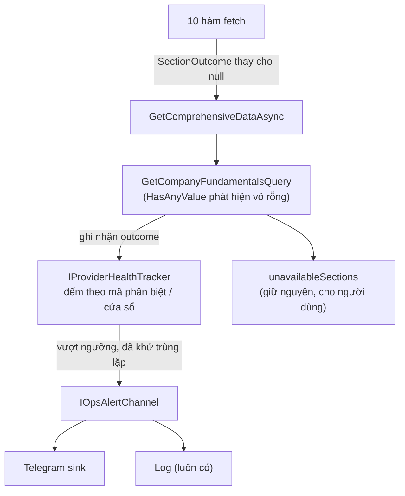

# Cho provider số liệu hỏng ra tiếng (và mở đường bắn cảnh báo)

**Ngày:** 2026-08-11
**Tầng chạm:** Infrastructure → Application → (Api, chỉ cấu hình)
**Tiền đề:** [PR #158](https://github.com/XcodeFi/invest-mate-v2/pull/158) đã sửa lệch hợp đồng. Việc này sửa **cơ chế** đã khiến lỗi đó sống nhiều tháng.
**ADR:** **Cần** — thêm tích hợp ngoài (kênh cảnh báo) và đổi hợp đồng xử lý lỗi của cả một provider. Viết trước khi code, theo [`docs/adr/template.md`](../adr/template.md).

## Thuật ngữ

| Viết tắt | Tên đầy đủ | Nghĩa ở đây |
|---|---|---|
| provider | — | Lớp gọi API bên ngoài lấy số liệu (`HmoneyComprehensiveDataProvider`) |
| section | — | Một khối dữ liệu trong panel số liệu (`peers`, `businessPlan`, …) |
| contract drift | — | Bên cung cấp đổi cấu trúc JSON, code vẫn khai theo cấu trúc cũ |
| vỏ rỗng | empty shell | Parse trót lọt, đủ số phần tử, nhưng mọi field đều null |
| ops alert | operational alert | Cảnh báo cho **người vận hành** (bạn), khác hẳn cảnh báo giá cho người dùng |

## Vì sao

Cả 10 hàm fetch trong `HmoneyComprehensiveDataProvider` đều kết thúc y hệt nhau:

```csharp
catch (Exception ex)
{
    _logger.LogWarning(ex, "Failed to get X for {Symbol}", symbol);
    return null;
}
```

`null` ở đây gộp **bốn** tình huống khác hẳn nhau về mức nghiêm trọng:

| Tình huống | Mức nghiêm trọng | Hiện tại phân biệt được? |
|---|---|---|
| Nguồn đổi cấu trúc (`JsonException`) | **Nặng** — mọi mã đều mất dữ liệu, cần sửa code | ❌ |
| Parse được nhưng **vỏ rỗng** (đổi tên khoá) | **Nặng** — như trên, mà còn không ném exception | ❌ |
| Nguồn lỗi/timeout nhất thời | Nhẹ — tự khỏi | ❌ |
| Mã này thật sự không có dữ liệu đó | Bình thường | ❌ |

Vì cả bốn đều thành `null`, giao diện hiện đúng một câu "không lấy được dữ liệu" cho tất cả. **Lệch hợp đồng trông y hệt "công ty này không có số liệu đó"** — và đó là lý do lỗi sống được nhiều tháng.

Nó lộ ra **tình cờ**, từ log của một server nền còn sót lại sau một lần verify khác. Không phải từ test, không phải từ giám sát. Đó là điều việc này phải sửa.

## Điều then chốt: một mã ≠ nhiều mã

Đây là phần dễ làm sai nhất, nên nói trước.

> **Một section hỏng ở MỘT mã** = mã đó thiếu dữ liệu. Bình thường. Im lặng.
> **Cùng một section hỏng ở NHIỀU mã khác nhau** = hợp đồng đã đổi. Bắn cảnh báo.

Cảnh báo theo từng lần gọi là con đường chắc chắn dẫn tới việc tắt thông báo sau hai ngày, và lúc đó ta còn tệ hơn hiện tại — vì sẽ tin rằng "có giám sát rồi".

Endpoint lại có cache 15 phút theo mã, và cả panel lẫn tool MCP cùng vào một chỗ, nên tần suất gọi không đều. Vì vậy phải đếm theo **số mã phân biệt trong một cửa sổ thời gian**, không đếm theo số lần gọi.

## Kiến trúc



Hai đường tách bạch: người dùng vẫn chỉ thấy `unavailableSections` như cũ; người vận hành có đường riêng.

## Phần A — Provider nói rõ nó hỏng kiểu gì

### Bước A1 — Kiểu kết quả thay cho `null`

```csharp
public enum SectionFailure
{
    None,           // lấy được
    NoData,         // nguồn trả 200 nhưng không có dữ liệu cho mã này — BÌNH THƯỜNG
    ContractDrift,  // JsonException, hoặc parse được mà rỗng ruột
    Upstream        // HTTP lỗi, timeout, DNS — nhất thời
}

public sealed record SectionOutcome<T>(T? Value, SectionFailure Failure, string? Detail);
```

`Detail` là câu ngắn để người đọc cảnh báo hiểu ngay (`"$.data là object, code khai List<T>"`), **không** phải stack trace.

**Test trước:** mỗi loại lỗi map đúng một `SectionFailure`. Đặc biệt: `JsonException` ⇒ `ContractDrift`, còn `TaskCanceledException` ⇒ `Upstream`. Hai cái này mà lẫn thì cảnh báo hoặc câm hoặc loạn.

⚠️ `catch (Exception)` bắt tất, kể cả `OperationCanceledException` khi người dùng đóng tab. Phân loại nó là `Upstream` sẽ đếm nhầm; phải để riêng và **không** tính vào bất cứ bộ đếm nào.

### Bước A2 — Vỏ rỗng cũng là drift

Đây là loại nguy hiểm nhất và **không** ném exception nào: nguồn đổi tên khoá, `JsonSerializer` vẫn dựng object, mọi field null.

`GetCompanyFundamentalsQuery.HasAnyValue` **đã** phát hiện được ca này (thêm từ một lần sửa trước) — nhưng nó chỉ dùng để lọc, rồi vứt thông tin đi. Việc ở đây là **giữ lại** kết luận đó: parse thành công mà `HasAnyValue` trả `false` ⇒ nâng lên `ContractDrift`.

Đặt bộ phát hiện ở **tầng query**, không ở provider — provider không có `HasAnyValue`, và nhân đôi vị từ đó ra hai chỗ là mở sẵn cửa để hai chỗ lệch nhau.

**Test trước:** provider trả object đủ shape mà mọi field null ⇒ outcome là `ContractDrift`, không phải `NoData`.

### Bước A3 — Bộ đếm theo mã phân biệt

```csharp
public interface IProviderHealthTracker
{
    void Record(string section, SectionFailure failure, string symbol, string? detail);
}
```

Cài bằng `IMemoryCache` (đã có sẵn trong provider), cửa sổ trượt **6 giờ**, khoá theo `section`. Giữ `HashSet<string>` các mã phân biệt đã hỏng.

Ngưỡng bắn: **cùng một section, `ContractDrift`, ≥ 3 mã phân biệt trong 6 giờ.**

Vì sao 3: một mã có thể lạ, hai mã có thể trùng hợp (cùng sàn, cùng ngành), ba mã khác nhau thì gần như chắc chắn là hợp đồng đổi. Con số này chỉnh được qua cấu hình; đừng hardcode.

`Upstream` **không** bắn theo ngưỡng này — nguồn chập chờn là chuyện thường. Nếu muốn theo dõi thì để riêng, ngưỡng cao hơn nhiều và cửa sổ dài hơn.

⚠️ **Ghi dấu đã-bắn NGAY sau khi qua cổng, trước khi gửi.** Gửi trước rồi mới ghi thì hai request song song cùng vượt ngưỡng sẽ cùng qua cổng và bắn hai lần — đúng ca đã dính một lần ở chỗ khác.

**Test trước:** 2 mã ⇒ không bắn; mã thứ 3 ⇒ bắn đúng một lần; mã thứ 4, 5 trong cùng cửa sổ ⇒ im lặng; qua cửa sổ ⇒ bắn lại được.

### Bước A4 — Giao diện kênh cảnh báo

```csharp
public interface IOpsAlertChannel
{
    Task SendAsync(OpsAlert alert, CancellationToken ct = default);
}

public sealed record OpsAlert(
    string Title,       // "Lệch hợp đồng 24hmoney"
    string Section,     // "businessPlan"
    string Detail,      // "$.data là object, code khai List<T>"
    IReadOnlyList<string> Symbols,   // mã đã quan sát thấy
    DateTimeOffset FirstSeenUtc);
```

Bản cài mặc định là `LogOpsAlertChannel` — chỉ ghi log ở mức `Error`. **Phần A tự nó đã có ích** kể cả khi chưa có Telegram: hiện tại drift chỉ ra `Warning` lẫn trong hàng nghìn dòng khác.

⚠️ Kênh cảnh báo **không bao giờ được làm hỏng request**. Bọc `try/catch` riêng và nuốt lỗi của chính nó — nhưng ghi log ở mức khác, vì một bộ báo động hỏng mà im lặng thì tệ hơn không có.

## Phần B — Kênh Telegram (bạn làm)

Phần A không phụ thuộc phần B. Hợp đồng giữa hai bên gói gọn trong `IOpsAlertChannel` — thêm Telegram là thêm một bản cài và đăng ký DI, **không đụng gì vào provider**.

### Những cái bẫy đã biết

**Gói Serilog cho Telegram:** `Serilog.Sinks.Telegram` gốc đã chết. Dùng bản fork **`Serilog.Sinks.Telegram.Alternative`** (FantasticFiasco). Tham số là `batchSizeLimit`, **không** phải `batchPostingLimit` — gõ nhầm thì không biên dịch được, mà thông báo lỗi lại không chỉ thẳng ra.

**Telegram không render bảng Markdown.** Ký tự `|` hiện nguyên xi thành rác. Soạn text riêng cho kênh này: mỗi mã một dòng, không kẻ bảng, và cân nhắc bỏ hẳn `parse_mode` — chỉ cần một ký tự đặc biệt trong tên công ty là cả tin nhắn hỏng.

**Bot token là bí mật.** `appsettings.json` chỉ được chứa placeholder `{Telegram__BotToken}` theo đúng quy ước sẵn có; giá trị thật đặt qua biến môi trường / Secret Manager. Nhớ ghi bước đặt biến môi trường vào checklist deploy — thiếu nó thì provider vẫn chạy nhưng cảnh báo câm, đúng kiểu hỏng khó thấy nhất.

**Serilog ở dự án này đọc sink từ cấu hình** (`config.ReadFrom.Configuration(context.Configuration)` trong `Program.cs`), nên thêm sink là việc của `appsettings`, không phải sửa code.

### Hai lựa chọn, nên cân nhắc trước khi code

| Cách | Được | Mất |
|---|---|---|
| **Sink Serilog** — bắn theo mức log | Không phải viết code gửi; dùng lại hạ tầng sẵn có | Khó khử trùng lặp và khó áp ngưỡng "≥3 mã"; dễ thành spam |
| **`TelegramOpsAlertChannel`** cài `IOpsAlertChannel`, gọi Bot API thẳng | Kiểm soát hoàn toàn ngưỡng, nội dung, tần suất | Phải tự viết HTTP + retry |

Khuyến nghị: **cách hai**. Logic "≥3 mã phân biệt trong 6 giờ" nằm ở phần A rồi, nên kênh chỉ cần gửi đúng thứ được đưa. Dùng sink theo mức log sẽ kéo ngược quyết định lọc xuống tầng logging, chỗ không biết gì về mã chứng khoán.

## Không làm trong phạm vi này

- **Không** đổi `unavailableSections` hay bất cứ thứ gì người dùng nhìn thấy. Người dùng không cần biết là drift hay hết dữ liệu — họ cần biết con số đang thiếu, và câu đó đã đúng rồi.
- **Không** đụng `AlertEvaluationService`. Đó là cảnh báo **giá và danh mục cho người dùng**, hoàn toàn khác việc này. Gộp hai thứ vào một đường là sau này không tắt riêng được cái nào.
- **Không** sửa 3 provider Hmoney còn lại (`MarketData`, `GoldPrice`, `BankRate`) dù chúng cùng kiểu nuốt lỗi. Làm xong một cái, dùng thật một thời gian, rồi mới nhân rộng — ngưỡng và mức ồn phải đo bằng thực tế.

## Rủi ro

| Rủi ro | Xử lý |
|---|---|
| Cảnh báo ồn quá rồi bị tắt — tệ hơn hiện tại vì tưởng là có giám sát | Ngưỡng theo **mã phân biệt**, khử trùng lặp theo cửa sổ, `Upstream` không bắn |
| Cảnh báo câm mà không ai biết (thiếu biến môi trường, token sai) | Log ở mức `Error` khi kênh gửi thất bại; cân nhắc một tin nhắn "còn sống" định kỳ |
| Bộ đếm phình bộ nhớ | `IMemoryCache` có hạn dùng theo cửa sổ; chỉ giữ mã phân biệt, không giữ payload |
| Phân loại sai `OperationCanceledException` thành lỗi nguồn | Bắt riêng, không tính vào bộ đếm nào |
| Đổi kiểu trả về của 10 hàm là diff to | Đây là diff **cơ học**; chạy đủ test sau mỗi hàm, đừng gộp với thay đổi hành vi nào khác |

## Thứ tự làm

1. Viết ADR (quyết định: đổi hợp đồng lỗi + thêm kênh cảnh báo vận hành).
2. A1 → A2 → A3 → A4, mỗi bước test trước.
3. Chạy thật vài ngày với `LogOpsAlertChannel`, xem tần suất có hợp lý không.
4. **Chỉ khi con số nhìn hợp lý** mới nối Telegram — nối sớm là tự tạo một nguồn ồn rồi tập phản xạ bỏ qua nó.

Bước 3 quan trọng hơn vẻ ngoài của nó: ngưỡng đặt trên giấy gần như luôn sai lần đầu.
