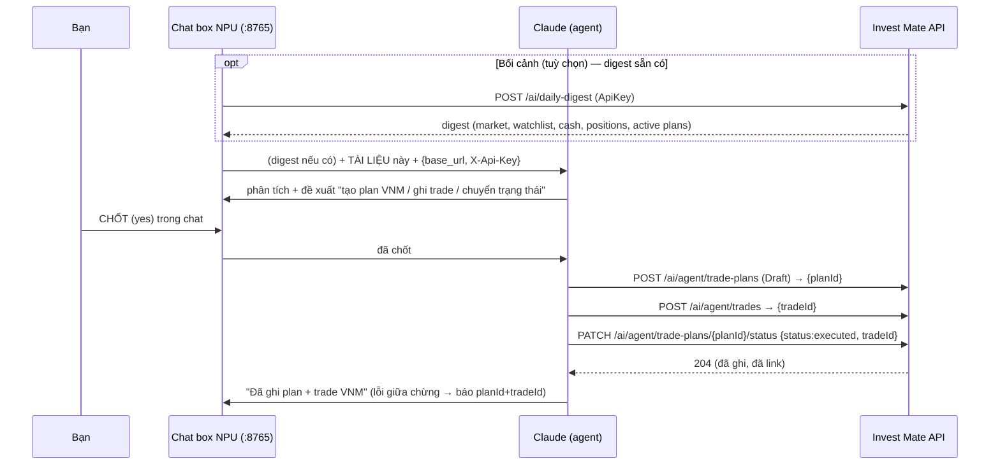

# API cho AI-Agent quản lý Trade Plan — Thiết kế

**Ngày:** 2026-07-21
**Trạng thái:** Bản nháp (đã qua 2 agent phản biện + chỉnh theo đúng bối cảnh) — chờ review cuối
**Phạm vi:** Backend invest-mate-v2 + tài liệu API gửi cho Claude. Phần npu-assistant là spec follow-up riêng (F1).

**Bản chất app:** invest-mate-v2 là **nhật ký / tracker** — ghi lại lịch sử giao dịch + quyết định. **KHÔNG đặt lệnh với sàn, KHÔNG dịch chuyển tiền thật.** Mọi bản ghi **sửa/xoá được**. ⇒ Rủi ro để AI ghi dữ liệu là **thấp** (sai thì sửa), không phải rủi ro tài chính.

## 1. Mục tiêu & bối cảnh

Trong **chat box NPU local**, một phiên thường bắt đầu từ **bản tin digest** ([`AiDigestController`](../../../src/InvestmentApp.Api/Controllers/AiDigestController.cs), `POST /api/v1/ai/daily-digest`) — nhưng digest chỉ là **bối cảnh, không phải dependency**. Điểm cốt lõi: **ngay trong cùng phiên đó, Claude có thể thực hiện các việc liên quan tới cổ phiếu đang bàn** — lập plan, ghi trade, chuyển trạng thái, execute cho mã đó — sau khi người dùng **chốt** trong chat.

Nói gọn: chat box NPU lo phần *phân tích + đề xuất + chốt*; spec này cung cấp **API để Claude hành động trên cổ phiếu ngay trong phiên** — độc lập, dùng được cả trong phiên digest lẫn phiên chat thường.

Thao tác cần: **lập plan, sửa plan, chuyển trạng thái, thực hiện (ghi Trade + Executed)**.

## 2. Vai trò

| Thành phần | Trách nhiệm |
|---|---|
| **NPU local** (`http_server.py`, :8765) | Chat box + relay. Kéo digest, đưa cho Claude, **gửi tài liệu này + inject `base_url`+`X-Api-Key`** (key không nằm trong tài liệu), hiển thị đề xuất, thu **"chốt"** của người dùng, hiển thị kết quả. |
| **Claude** (`claude -p`) | Agent. Đọc digest + tài liệu, đề xuất plan/quyết định, sau khi người dùng chốt thì dựng payload hợp lệ và gọi API bằng curl. |
| **Invest Mate API** (prod Cloud Run) | System of record (nhật ký). Bề mặt curated qua `X-Api-Key`; enforce quyền sở hữu per-user + state machine. |

## 3. Ngoài phạm vi

- Code npu-assistant (kéo digest sẵn có, chèn tài liệu, cấp shell cho Claude, thu "chốt", config) — F1.
- Daily-routines (lập lịch) — hoãn.
- Phân quyền scope cho API key.
- Campaign review, thesis-abort, soft-delete, CRUD scenario-template, bulk-trade, xoá trade, `restore`, multi-lot execute, stop-loss — không thuộc bề mặt agent v1 (giữ surface gọn; đưa lên v2 nếu cần).

## 4. Luồng

## 5. Bề mặt agent v1 (`/api/v1/ai/agent`)

| # | Thao tác | Endpoint | Command | Ghi chú |
|---|----------|----------|---------|---------|
| 1 | Lập plan | `POST /trade-plans` | `CreateTradePlanCommand` | Adapter null-out `status`+`tradeId` (ép Draft — §8). |
| 2 | Sửa plan | `PUT /trade-plans/{id}` | `UpdateTradePlanCommand` | |
| 3 | Chuyển trạng thái | `PATCH /trade-plans/{id}/status` | `UpdateTradePlanStatusCommand` | Adapter chỉ cho `ready`/`inprogress`/`executed`/`cancelled`; **400 nếu `restore`** (§8). |
| 4 | Ghi Trade | `POST /trades` | `CreateTradeCommand` | IDOR fix 3 bước ở handler (§8). |
| R | Đọc | `GET /trade-plans[?activeOnly=]`, `GET /trade-plans/{id}` | Query | |

## 6. Quy tắc business Claude BẮT BUỘC tuân (giữ vì tính đúng đắn, không phải an toàn tiền)

1. **Discipline gate** (chặn `Draft→Ready`): thesis ≥15 ký tự; nếu `quantity×entryPrice ≥ 5%` của `accountBalance` → thesis ≥30 + ≥1 invalidation rule `detail` ≥20 ký tự. *(Lưu ý: `LegacyExempt=true` sẽ skip gate — [TradePlan.cs:173](../../../src/InvestmentApp.Domain/Entities/TradePlan.cs#L173) — nhưng flag này chỉ set qua constructor, endpoint agent không set nên plan do AI tạo luôn `false`; ghi ra để không tưởng gate là tuyệt đối.)*
2. **`accountBalance` nên có** khi tạo plan: thiếu nó gate chỉ còn check 15 ký tự dù lệnh lớn. Endpoint agent cảnh báo/khuyến nghị gửi kèm.
3. **Validator:** plan `entryPrice/stopLoss/quantity > 0`; invalidation `trigger ∈ {EarningsMiss, TrendBreak, NewsShock, ThesisTimeout, Manual}`, `detail` ≥20. Trade: `tradeType ∈ {BUY, SELL}`, `quantity/price > 0`, `fee/tax ≥ 0`, `symbol ≤10`.
4. **Bất biến:** plan `Executed`/`Reviewed` từ chối `Update` → GET status trước khi sửa.
5. **Trade trước Executed:** ghi Trade → rồi mới mark Executed (cần `tradeId`).

## 7. Sản phẩm 1 — Tài liệu API gửi cho Claude

**Nguồn:** `docs/references/AI-Agent-TradePlan-API.md` (trong repo, sinh trong CI).

**Lưu local + Claude trỏ tới như mục lục (không nhồi vào context):** tài liệu được **cache thành FILE ở máy local** (thư mục của NPU). NPU **KHÔNG gửi cả doc vào prompt mỗi phiên**; thay vào đó đưa cho Claude **đường dẫn file** + một dòng chỉ dẫn "tra tài liệu API ở đây trước khi hành động". Vì Claude (`claude -p`) có tool đọc file, nó **đọc/grep đúng mục cần** theo **mục lục (table of contents)** ở đầu doc — chỉ nạp phần liên quan, tiết kiệm context.

**Versioning + tải một lần:** doc có **`version` của chính tài liệu = version API mỗi lần deploy** (deploy API `vX` ⇒ doc mang `vX`, quan hệ 1:1). Version được **đóng dấu vào doc lúc build/deploy** (đọc từ release/tag của API, không phải hash tự tính). Backend serve qua `GET /api/v1/ai/agent/doc` với **`ETag = docVersion`**. NPU tải file **một lần**; mỗi phiên gửi **conditional GET** (`If-None-Match: <version-cache>`):
- `304 Not Modified` → dùng file local đã cache (không tải lại).
- `200 OK` + doc mới → chỉ khi app đổi version/contract → NPU ghi đè file local.

Đúng ý "lưu local, chỉ tải lại khi version app đổi".

**Mục lục (bắt buộc):** đầu doc là bảng *ý định → mục*, ví dụ: "lập plan → §Create", "ghi trade → §Trade", "chuyển trạng thái → §Status", "full-execute → §Recipe" — để Claude nhảy thẳng tới đúng các bước cần làm cho một hành động.

**Chống drift (đã hạ theo tooling thực tế):** project **chưa có** `Swashbuckle.AspNetCore.Cli`/`dotnet-tools.json` (chỉ có Swashbuckle runtime trong .csproj) → `dotnet swagger tofile` **không chạy được** nếu không thêm tool. Mặc định: **doc viết tay** (schema + enum + narrative) + **drift test bằng reflection** (so tên field của `CreateTradePlanCommand`/`CreateTradeCommand`… với bảng trong doc; CI fail nếu lệch). Nếu sau muốn tự sinh hẳn → thêm Swashbuckle CLI (v2). Version doc vẫn bám deploy nên khi contract đổi, docVersion đổi ⇒ NPU kéo bản mới.

Schema: `CreateTradePlanCommand`/`UpdateTradePlanCommand` (đủ mục + enum), `CreateTradeCommand`, auth `X-Api-Key: {ApiKey}` (placeholder), base URL = config.

## 8. Sản phẩm 2 — Controller ApiKey mỏng, theo đúng precedent digest

**Kết luận dựa trên code thật (đã verify, không bịa):**
- Grep 34 chỗ `[Authorize(AuthenticationSchemes=…)]`: **không controller nào dùng comma multi-scheme**; mọi controller pin đúng **một** scheme.
- Cách codebase cho một op gọi bằng ApiKey = **tách controller riêng pin ApiKey**, chính là [`AiDigestController.cs:16`](../../../src/InvestmentApp.Api/Controllers/AiDigestController.cs#L16) (`[Authorize(AuthenticationSchemes = ApiKeyAuthenticationDefaults.Scheme)]`).
- Auth setup (Program.cs:305–372): `DefaultScheme=Cookie`, `DefaultChallenge=Google`, `AddAuthorization` chỉ thêm `GcpSchedulerPolicy` — **không có FallbackPolicy**. Trộn JWT+ApiKey trên controller user-facing là thứ team đã tránh (comment AiDigestController).

⇒ **Không** mở comma-scheme trên `TradePlansController`/`TradesController` (chưa từng dùng ở đây + với `DefaultChallenge=Google` dễ sinh hành vi lạ khi fail). Thay vào đó: **một controller mỏng pin ApiKey**, route `api/v1/ai/agent`, **re-dispatch các MediatR command sẵn có** (CreateTradePlan/Update/Status/CreateTrade…).

**"Tận dụng API sẵn có" vẫn đúng:** reuse 100% ở tầng **command/handler/domain** — không viết lại business logic; chỉ thêm lớp adapter auth y hệt digest. Ưu điểm kèm theo: curate được payload (ép Draft, bỏ `restore`) ngay tại adapter.

**Vẫn cần (độc lập) — mô tả chính xác theo code:**
- **Sửa IDOR ở HANDLER (3 bước, không phải 1):** `CreateTradeCommand` [CreateTradeCommand.cs:7-17](../../../src/InvestmentApp.Application/Trades/Commands/CreateTrade/CreateTradeCommand.cs#L7-L17) **không có field `UserId`**; handler [:38](../../../src/InvestmentApp.Application/Trades/Commands/CreateTrade/CreateTradeCommand.cs#L38) chỉ check portfolio tồn tại. Fix: (1) thêm `[JsonIgnore] public string UserId`, (2) adapter set từ `sub`, (3) handler assert `portfolio.UserId == UserId` else `UnauthorizedAccessException`. Tương tự verify `StrategyId`/`tradeId` truyền vào. Sửa ở handler đóng cả surface JWT lẫn ApiKey.
- **Guard ở adapter (vì re-dispatch command chung):** `restore` vẫn nằm trong `UpdateTradePlanStatusCommand` [:73](../../../src/InvestmentApp.Application/TradePlans/Commands/UpdateTradePlanStatus/UpdateTradePlanStatusCommand.cs#L73) → adapter **reject `status=="restore"` bằng 400**. `CreateTradePlanCommand.Status`/`TradeId` là public [:47-48](../../../src/InvestmentApp.Application/TradePlans/Commands/CreateTradePlan/CreateTradePlanCommand.cs#L47-L48) → adapter **null-out** trước khi dispatch (ép Draft thật sự).
- **Audit dấu AI:** `AuditEntry` **không có field `Source`** → nhét `"source":"AI_AGENT"` vào `Metadata` (không đổi schema/migration). Nhận biết qua claim `api_key_id`.
- **Serve tài liệu (§7):** `GET /api/v1/ai/agent/doc`, `ETag=docVersion`.

(comma-OR `[Authorize(AuthenticationSchemes="Bearer,ApiKey")]` là hợp lệ trong ASP.NET Core — nhưng không chọn ở đây vì không có tiền lệ trong codebase + rủi ro challenge=Google.)

## 9. Claude gọi API — curl

curl qua shell agent, `X-Api-Key`+`base_url` do NPU inject. Không để key trong argv (rò ra history/process list) — truyền qua **env-var** hoặc file `-K`. Nếu PATCH executed fail sau khi đã ghi trade → Claude báo rõ `planId`+`tradeId` để dọn tay (Mongo không txn đa-document).

## 10. Xác nhận = "chốt" trong chat NPU (human-in-loop)

Confirm không phải prompt suông: **người dùng chốt tường minh trong chat box NPU** sau khi xem đề xuất (thường bắt nguồn từ digest đã review). Claude chỉ ghi sau khi có "chốt". Vì app là nhật ký, không tiền thật, sửa được → đây là mức xác nhận phù hợp; không cần server-side approval. Giữ vài hygiene rẻ: key revoke được qua UI, `restore` để ngoài surface, audit `Source=AI_AGENT`.

## 11. Auth & bẫy scheme (theo code hiện tại)

Setup xác thực (Program.cs:305–372): `AddAuthentication` đăng ký Cookie / Google / **JwtBearer** (`MapInboundClaims=false`) / GcpOidc / **ApiKey**; `DefaultScheme=Cookie`, `DefaultChallenge=Google`. `AddAuthorization` chỉ thêm `GcpSchedulerPolicy` — **không FallbackPolicy/DefaultPolicy tuỳ biến**.

Handler ApiKey ([ApiKeyAuthExtensions.cs](../../../src/InvestmentApp.Api/Auth/ApiKeyAuthExtensions.cs)) đọc `X-Api-Key`, phát `sub`+`api_key_id` → `GetUserId()` chạy y JWT.

**Bẫy:** hai attribute `[Authorize]` khác scheme = AND (không xác thực được) — lý do digest tách controller riêng. Comma trong MỘT attribute = OR (hợp lệ) nhưng codebase chưa dùng (§8). Vì `DefaultChallenge=Google`, request API fail auth sẽ 302 về Google thay vì 401 — client máy (NPU/Claude) phải xử lý đúng (đọc status/redirect), giống hạn chế hiện có của digest.

## 12. Ghi chú an toàn (đã hạ cấp theo bản chất app)

- Không tiền thật, không đặt lệnh sàn, dữ liệu sửa/xoá được → sai sót của AI = phiền toái nhỏ, không tổn thất.
- Human-in-loop qua "chốt" (§10) là điểm kiểm soát chính.
- **Không phải incident:** `appsettings.Production.json` có secret thật nhưng **đã gitignore, chưa từng commit** — agent phản biện báo nhầm "committed", đã verify sai. Key AI mới theo đúng pattern gitignore/env-var.
- Tài liệu dùng placeholder `{ApiKey}` + host config.

## 13. Kiểm thử

- **Integration:** mỗi endpoint — 401 khi thiếu key; map `sub`→sở hữu; thao tác loại không có route; `POST /trades` portfolio không sở hữu → 403; `StrategyId` user khác → 403.
- **Discipline-gate:** thesis <15 → 400; plan ≥5% thiếu invalidation → 400.
- **Drift test:** so field/enum doc-sinh-từ-OpenAPI với command class; CI fail nếu lệch.
- **Full-execute happy path (prod, mã throwaway):** tạo plan → ghi trade → status executed → assert linked; dọn bằng cancel + xoá trade.

## 14. Câu hỏi mở / follow-up

- **F1 (spec riêng):** npu-assistant — dùng digest sẵn có, chèn tài liệu, cấp shell cho Claude, inject key qua env, thu "chốt" trong chat, config.
- **Đã chốt:** ghi nhật ký (không tiền thật) → xác nhận = human "chốt" trong chat NPU; gọi = curl; thực hiện = full (ghi Trade + Executed).

## 15. Findings từ 2 agent phản biện (đã hạ cấp theo bản chất "nhật ký, không tiền thật")

| # | Sev gốc | Sev sau reframe | Xử lý |
|---|---------|-----------------|-------|
| Secrets committed | BLOCKER | **False positive** | Đã verify gitignored (§12) |
| 1 Confirm gate là prompt | BLOCKER | **LOW** | Confirm thật = "chốt" trong chat (§10); không tiền thật |
| 2 IDOR ownership | HIGH | **MED** (hygiene) | Sửa ở handler (§8) |
| 3 Key trong curl argv | HIGH | **LOW** | env-var/`-K` (§9) |
| 4 One-shot execute bypass | HIGH | **LOW** | Ép Draft cho gọn (§5.1) |
| 5 accountBalance tụt gate | HIGH | **MED** (đúng đắn) | Khuyến nghị gửi kèm (§6.2) |
| 6 `restore` phá linkage | HIGH | **LOW** | Để ngoài surface (§3,§5) |
| 7 Doc drift | HIGH | **MED** (bảo trì) | Doc viết tay + drift test reflection (§7) |
| 8 Partial-commit orphan | MED | **LOW** | Báo planId+tradeId, sửa tay (§9) |
| 9 Scope inflation | MED | **giữ** | Cắt multi-lot+stop-loss xuống v2 (§5) |
| 10 Không dấu AI trong audit | LOW | **giữ** | Nhét vào `Metadata` (§8) |

**Vòng 2 (bắt buộc cite code) — sửa chính xác theo code:**

| Finding | Code | Đã fix ở |
|---|------|----------|
| `CreateTradeCommand` không có field `UserId` (fix 3 bước) | CreateTradeCommand.cs:7-17,38 | §8 |
| `restore` reachable qua shared command → cần guard 400 | UpdateTradePlanStatusCommand.cs:73 | §8,§5 |
| `Status`/`TradeId` public → adapter null-out | CreateTradePlanCommand.cs:47-48 | §8,§5 |
| `AuditEntry` không có field `Source` → dùng `Metadata` | AuditEntry.cs | §8 |
| `dotnet swagger tofile` CLI chưa cài → doc viết tay + drift test | InvestmentApp.Api.csproj | §7 |
| `LegacyExempt` skip gate (agent path không set) | TradePlan.cs:173 | §6 |
| Digest context đã đủ, không trùng lặp (positive) | AiAssistantService.cs:444 | xác nhận §1 |
