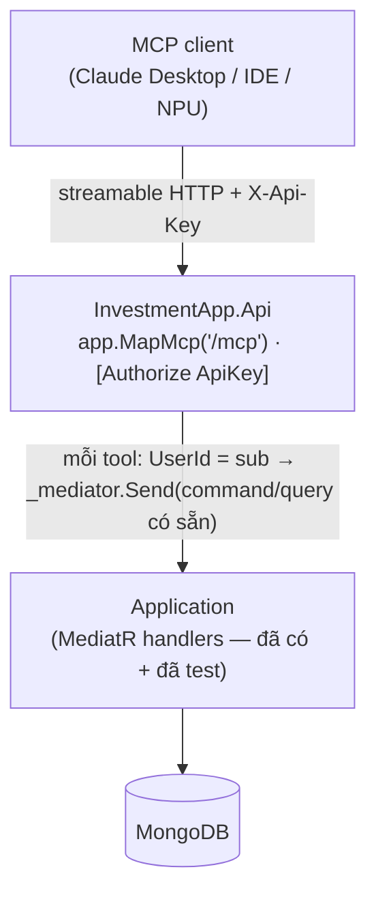

# Thiết kế: MCP server cho Invest Mate (co-host trong .NET API)

**Ngày:** 2026-07-24
**Trạng thái:** Đã duyệt hướng (brainstorm) → chờ review spec → writing-plans
**Phạm vi:** `InvestmentApp.Api` (thêm MCP endpoint + tool wrappers + test). Không đụng Application/Domain/frontend.
**Liên quan:** ADR-0003 (per-user API keys), ADR-0004 (agent write surface via ApiKey), spec `2026-07-23-agent-watchlist-positions-expose-design.md` (đã tách MCP thành "mảng (b) — spec riêng sau"; đây chính là mảng đó).

## 1. Mục tiêu

Cho phép **nhiều MCP client** (Claude Desktop, Claude Code, IDE, host MCP khác) cắm thẳng vào Invest Mate và thao tác trực tiếp qua **tool có schema**, thay vì phải tự đọc doc markdown rồi `curl` REST như hiện tại. Động lực chính: **đa client** (không chỉ NPU).

## 2. Bối cảnh: hiện tại vs MCP

**Hiện tại** — NPU `agent_api.py` chạy `claude -p` với tool `[Read, Bash(curl:*), WebSearch, WebFetch]`. Claude đọc doc markdown (`/ai/agent/doc`, cache + ETag) → tự map ý định → `curl` `/api/v1/ai/agent/*` (khóa `X-Api-Key` qua file tạm). Gate "chốt" ở persona.

| | Hiện tại (curl + doc) | MCP server |
|---|---|---|
| Cách gọi | Claude đọc prose rồi tự dựng curl | Client gọi tool có schema (discovery) |
| Token/độ chính xác | Tốn token đọc manual; dễ sai endpoint/field | Ít token; validate tại boundary |
| Client | Tiện nhất với Claude-CLI | Đa host MCP cắm thẳng |
| Bảo mật | `Bash(curl:*)` rộng, rào bằng persona | Bề mặt hẹp: chỉ tool expose |
| Gate ghi | Trust-model ở persona | Annotation read/destructive → host prompt |
| Hạ tầng | Không thêm gì | Thêm endpoint (co-host, không thêm service) |

MCP **không thay** REST — nó **bọc** lại (cùng dispatch MediatR). REST `/api/v1/ai/agent/*` giữ nguyên; MCP là additive.

## 3. Quyết định (từ brainstorm)

- **Transport:** remote **HTTP** (streamable HTTP) — để đa client cắm từ xa.
- **Hosting:** **co-host trong `InvestmentApp.Api`** (SDK `ModelContextProtocol.AspNetCore`, `MapMcp`). Tái dùng deploy Cloud Run, không thêm service.
- **Tool:** wrapper mỏng **dispatch MediatR command/query có sẵn** — không business logic mới (giống `AiAgent*Controller`).
- **Auth:** **ApiKey bearer**, tái dùng ADR-0003 (`UserId` = claim `sub`). Thiết kế mở để thêm OAuth 2.1 sau nếu 1 client bắt buộc.
- **Gate ghi:** annotation `readOnlyHint`/`destructiveHint` → host MCP tự prompt xác nhận; NPU vẫn giữ "chốt" riêng.

## 4. Kiến trúc

- Đăng ký: `builder.Services.AddMcpServer().WithHttpTransport().WithTools<...>()`; `app.MapMcp("/mcp")` sau middleware auth ApiKey.
- Tool class chứa `[McpServerTool]` method; inject `IMediator` + resolve `UserId` từ `HttpContext.User` (claim `sub`) — cùng cơ chế `AiAgentControllerBase.GetUserId()`.

## 5. Tool (cắt lát)

Bề mặt agent ~20 op → **không làm hết một lần**.

**Slice 1 (core):**
| Tool | MediatR | Annotation |
|---|---|---|
| `list_trade_plans` | `GetTradePlansQuery` | read |
| `get_trade_plan` | `GetTradePlanByIdQuery` | read |
| `list_positions` | `GetActivePositionsQuery` | read |
| `list_portfolios` | `GetAllPortfoliosQuery` | read |
| `calculate_fees` | `AgentTradeFeeCalculator` | read |
| `create_trade_plan` | `CreateTradePlanCommand` (ép Draft) | destructive |
| `set_trade_plan_status` | `UpdateTradePlanStatusCommand` (chặn restore) | destructive |
| `create_trade` | `CreateTradeCommand` (auto-resolve portfolio/fee/tax như #124/ADR-0005/0006) | destructive |

**Slice 2 (sau):** watchlist CRUD, journals + journal-entries CRUD, symbol timeline, `update_trade_plan`.

## 6. Auth

- MCP endpoint đứng sau **đúng ApiKey scheme** hiện có; client cấu hình header/bearer = per-user ApiKey.
- Ownership: mọi tool set `UserId = sub` trước khi dispatch; handler đã filter/re-assert theo `UserId` (double-fence sẵn có). Không mở đường transitive mới.
- **OAuth 2.1**: ngoài phạm vi slice này; ghi nhận là lộ trình nếu client (vd ChatGPT connector) đòi discovery-based auth.

## 7. Confirm gate

- Tool ghi gắn `destructiveHint = true` → host MCP có human-in-the-loop tự hỏi xác nhận trước khi gọi. Tool đọc `readOnlyHint = true` chạy ngay.
- NPU (`agent_api.py`) nếu chuyển sang gọi MCP vẫn giữ gate "chốt" phía persona (không phụ thuộc host).

## 8. Test (`InvestmentApp.Api` test layer)

1. Mỗi tool dispatch đúng command/query + inject `UserId` từ `sub` (mirror `AiAgentControllerTests`).
2. Ownership: tool đọc/ghi của user A không chạm dữ liệu user B.
3. `create_trade` qua MCP auto-resolve portfolio/fee/tax đúng như REST (fee excl tax — ADR-0006).
4. Integration: MCP `initialize` + `tools/list` trả đủ tool slice-1 + annotation read/destructive đúng.
5. Thiếu/sai ApiKey → 401 (endpoint MCP behind auth).

## 9. Ngoài phạm vi (YAGNI)

- OAuth 2.1 (làm sau nếu client bắt buộc).
- Toàn bộ ~20 tool trong slice 1 (chỉ core; phần còn lại slice 2).
- Business logic / command / DTO mới (tái dùng 100%).
- Thay REST surface hoặc frontend.
- Đặt lệnh sàn thật.

## 10. Rủi ro / cần verify khi implement (không chốt ở spec)

- **SDK `ModelContextProtocol.AspNetCore` đang tiến hóa nhanh** — verify version + API (`AddMcpServer`/`WithHttpTransport`/`[McpServerTool]`/`MapMcp`) lúc scaffold (bài học "verify plan APIs before scaffolding"). Có thể lệch tên API.
- **Tương thích ApiKey bearer tĩnh theo host** — Claude Desktop custom connector / ChatGPT connector có nhận header tĩnh hay đòi OAuth? Ghi rõ per-client, test với ít nhất 1 host thật.
- **Streamable HTTP + Cloud Run** — kết nối SSE/streaming dài vs request timeout Cloud Run + quản session MCP; cần đo + cấu hình timeout/keep-alive.
- **`calculate_fees` không qua MediatR** (dùng `IFeeCalculationService` + helper) — tool này inject service trực tiếp như `AiAgentFeesController`.

## 11. Tiêu chí thành công

1. Một MCP host (vd Claude Desktop) cắm được vào `/mcp` bằng ApiKey, thấy đủ tool slice-1 với annotation đúng.
2. Gọi `list_positions`/`list_portfolios` trả dữ liệu thật của chủ khóa; `create_trade` (bỏ portfolioId/fee/tax) auto-resolve + ghi đúng (fee excl tax).
3. Tool ghi bị host prompt xác nhận (destructive); tool đọc chạy ngay.
4. Test ownership pass; không rò dữ liệu user khác.
5. REST `/ai/agent/*` không đổi; không thêm business logic; diff gọn trong `InvestmentApp.Api` + test.
