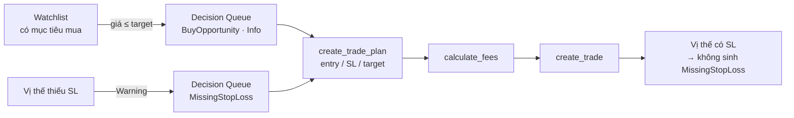

# Design — Decision Queue: bắt cơ hội mua & chặn vị thế không có stop-loss

**Ngày:** 2026-07-29
**Trạng thái:** Chờ review
**Phạm vi:** `GetDecisionQueueQuery` + `DecisionItemDto` + `ResolveDecisionCommand` (suppression) + `decision-queue.component.ts` + mô tả MCP tool `get_decision_queue`

---

## 1. Vấn đề

### 1.1 Decision Queue chỉ có phía thoát hàng, không có phía vào lệnh

`DecisionType` hiện chỉ có 3 giá trị — `StopLossHit`, `ScenarioTrigger`, `ThesisReviewDue` ([`DecisionItemDto.cs:7-17`](../../../src/InvestmentApp.Application/Decisions/DTOs/DecisionItemDto.cs#L7-L17)) — **toàn bộ là phòng thủ**. MCP tool `get_decision_queue` tự mô tả là *"Trả lời câu 'hôm nay cần quyết gì'"* ([`DecisionTools.cs:16`](../../../src/InvestmentApp.Api/Mcp/DecisionTools.cs#L16)), nhưng về mặt **cấu trúc** nó không thể chứa một cơ hội mua.

Cơ hội mua hiện chỉ sống trong bản tin dạng văn bản: `FormatWatchlistSection` in dòng `📉 {symbol}: giá {price} ≤ mục tiêu mua {target} (cơ hội)` ([`AiAssistantService.cs:372-374`](../../../src/InvestmentApp.Infrastructure/Services/AiAssistantService.cs#L372-L374)). Hệ quả: cơ hội **không** được dedupe, **không** có suppression theo ngày, **không** resolve được, và **không** xuất hiện ở Dashboard.

### 1.2 Vị thế không có stop-loss bị bỏ qua im lặng

[`GetDecisionQueueQuery.cs:155`](../../../src/InvestmentApp.Application/Decisions/Queries/GetDecisionQueue/GetDecisionQueueQuery.cs#L155):

```csharp
foreach (var pos in summary.Positions)
{
    if (pos.StopLossPrice == null) continue;
```

Vị thế **chưa đặt SL** không bao giờ vào queue. Đây là hướng sai lầm nguy hiểm nhất: queue rỗng đọc như *"danh mục an toàn"*, trong khi thực tế là *"rủi ro chưa đo được"*. Vị thế không có SL là vị thế có rủi ro không giới hạn — nó phải **nổi bật hơn**, không phải biến mất.

### 1.3 Bug có sẵn: resolve xong item hiện lại ngay

`HandleHoldWithJournalAsync` khi request không có `TradePlanId` đi vào nhánh symbol-only và để `portfolioId` giữ nguyên `null` ([`ResolveDecisionCommand.cs:219-222`](../../../src/InvestmentApp.Application/Decisions/Commands/ResolveDecision/ResolveDecisionCommand.cs#L219-L222)):

```csharp
else if (!string.IsNullOrEmpty(request.Symbol))
{
    symbol = request.Symbol;   // portfolioId vẫn null
}
```

Nhưng `LoadResolvedTodayAsync` lọc bỏ chính những entry đó trước khi build suppression set ([`:127-130`](../../../src/InvestmentApp.Application/Decisions/Queries/GetDecisionQueue/GetDecisionQueueQuery.cs#L127-L130)):

```csharp
var symPort = todayDecisions
    .Where(j => !string.IsNullOrEmpty(j.PortfolioId))   // ← entry symbol-only rơi ở đây
```

`StopLossHit` được tạo với `TradePlanId = null` ([`:176`](../../../src/InvestmentApp.Application/Decisions/Queries/GetDecisionQueue/GetDecisionQueueQuery.cs#L176)) và FE gửi `{ symbol }` trần cho nó ([`decision-queue.component.ts:241-243`](../../../frontend/src/app/features/dashboard/widgets/decision-queue.component.ts#L241-L243)) → **mọi lần "GIỮ + ghi lý do" trên card `StopLossHit` đều không suppress được**, card hiện lại sau refresh. Đúng thứ mà comment ở [`ResolveDecisionCommand.cs:164-167`](../../../src/InvestmentApp.Application/Decisions/Commands/ResolveDecision/ResolveDecisionCommand.cs#L164-L167) tuyên bố đã ngăn.

Hai type mới đều không có `tradePlanId` → đi vào đúng đường ống hỏng này. Không sửa thì tính năng mới ship ra là hỏng sẵn.

### 1.4 Frontend fallthrough dán nhãn sai một cách im lặng

```typescript
typeLabel(t: DecisionType): string {
  if (t === 'StopLossHit') return 'Stop-loss';
  if (t === 'ScenarioTrigger') return 'Kịch bản';
  return 'Review thesis';          // ← mọi type lạ rơi vào đây
}
```

`typeLabel()` và `getActionRoute()` đều dùng chuỗi `if` kết bằng `return` mặc định ([`:217-232`](../../../frontend/src/app/features/dashboard/widgets/decision-queue.component.ts#L217-L232)). Type mới sẽ bị dán nhãn **"Review thesis"** và điều hướng về `/symbol-timeline` — sai, không cảnh báo, không lỗi build.

### 1.5 Gap dữ liệu (không giải bằng code)

VNM/MSN/BVH có `TargetBuyPrice = null` → nhánh cơ hội ở §1.1 chưa bao giờ chạy. MWG/HPG/HHV chưa đặt SL. Đây là **con số người dùng phải quyết**, code không suy ra được. Xem §7.

---

## 2. Mục tiêu / Không làm

**Mục tiêu**

1. Decision Queue chứa được cả phía vào lệnh, không chỉ phía thoát hàng.
2. Vị thế không có SL không bao giờ vô hình.
3. Resolve một item thì item đó im đến hết ngày VN — kể cả item không gắn trade plan.
4. Không type nào bị FE dán nhãn sai; thêm type mới trong tương lai phải gây lỗi biên dịch chứ không im lặng.

**Không làm (out of scope)**

- Không thêm tín hiệu kỹ thuật (RSI/MACD) làm nguồn cơ hội — nhiễu cao, phụ thuộc độ tin cậy provider.
- Không thêm nút prefill "Lập kế hoạch" từ card cơ hội sang màn trade plan. Card mới chỉ hiển thị + resolve như các type hiện có.
- Không đổi signature MCP tool `get_decision_queue` → **không có rủi ro inputSchema regression**.
- Không điền hộ `TargetBuyPrice` / SL — xem §7.

---

## 3. Quyết định đã chốt với người dùng

| # | Câu hỏi | Chốt |
|---|---|---|
| 1 | Nguồn tín hiệu cơ hội | Watchlist target-hit + guard thiếu SL. Không dùng tín hiệu kỹ thuật. |
| 2 | Severity của `MissingStopLoss` | `Warning`. Giữ `Critical` cho "đã thủng SL" — nếu 3 vị thế thiếu SL đều đỏ thì tín hiệu thật bị loãng. |
| 3 | Severity của `BuyOpportunity` | `Info`. Cơ hội phải xếp dưới mọi rủi ro. |
| 4 | Phạm vi layer | Backend + MCP + FE render. Không prefill. |
| 5 | Bug suppression §1.3 | Sửa trong cùng phạm vi — nó chắn đường tính năng mới. |

---

## 4. Thiết kế

### 4.1 Hai `DecisionType` mới

| Type | Nguồn dữ liệu | Điều kiện | Severity |
|---|---|---|---|
| `BuyOpportunity` | `IWatchlistRepository.GetByUserIdAsync` + `IStockPriceService.GetCurrentPricesAsync` | `TargetBuyPrice > 0` **và** giá hiện tại `> 0` **và** giá ≤ `TargetBuyPrice` | `Info` |
| `MissingStopLoss` | `IRiskCalculationService.GetPortfolioRiskSummaryAsync` (đã fetch sẵn) | `StopLossPrice == null` **và** `CurrentPrice > 0` | `Warning` |

**Vì sao `BuyOpportunity` = `Info`:** thứ tự sort là Critical → Warning → Info ([`:92-96`](../../../src/InvestmentApp.Application/Decisions/Queries/GetDecisionQueue/GetDecisionQueueQuery.cs#L92-L96)). Đặt `Info` khiến cơ hội luôn nằm **dưới** mọi cảnh báo rủi ro — đúng thứ tự nên làm việc: xử lý vị thế đang chảy máu trước, mua thêm sau. Việc này kích hoạt `DecisionSeverity.Info` hiện đang mang comment *"reserved cho V2"* ([`DecisionItemDto.cs:27-28`](../../../src/InvestmentApp.Application/Decisions/DTOs/DecisionItemDto.cs#L27-L28)) — comment đó phải sửa.

**Guard `CurrentPrice > 0`** ở cả hai type sao chép logic có sẵn tại [`:158`](../../../src/InvestmentApp.Application/Decisions/Queries/GetDecisionQueue/GetDecisionQueueQuery.cs#L158). Symbol không lấy được giá là *"chưa biết"*, không phải *"thiếu SL"* hay *"chạm mục tiêu"*.

**Trường DTO:**

| Trường | `BuyOpportunity` | `MissingStopLoss` |
|---|---|---|
| `Id` | `BuyOpportunity:{symbol}` | `MissingStopLoss:{portfolioId}:{symbol}` |
| `PortfolioId` | `""` (watchlist không thuộc danh mục nào) | id danh mục |
| `Headline` | `{symbol} giá {price} ≤ mục tiêu mua {target}` | `{symbol} chưa đặt stop-loss (giá {price})` |
| `PlannedExitPrice` | `null` | `null` |
| `CurrentPrice` | giá hiện tại | giá hiện tại |
| `TradePlanId` | `null` | `null` |

`TradePlanId = null` ở cả hai khiến `canExecuteSell()` trả `false` ([`decision-queue.component.ts:224-226`](../../../frontend/src/app/features/dashboard/widgets/decision-queue.component.ts#L224-L226)) → nút BÁN tự ẩn. Đúng mong muốn: BÁN vô nghĩa với cả cơ hội mua lẫn lời nhắc đặt SL.

### 4.2 Thêm tập suppression thứ ba cho entry symbol-only

**Sửa lại so với đề xuất ban đầu.** Ý định đầu tiên là *thay* khoá `(symbol, portfolioId)` bằng `(symbol, type)`. Rà test cho thấy làm vậy sẽ phá [`Handle_StopLossHitWithDecisionJournalForDifferentPortfolio_NotSuppressed`](../../../tests/InvestmentApp.Application.Tests/Decisions/GetDecisionQueueQueryHandlerTests.cs#L394-L406) — test cố ý bảo vệ ngữ nghĩa *"cùng mã ở hai danh mục là hai quyết định khác nhau"*. Ngữ nghĩa đó đúng và đáng giữ.

Cách vá **cộng thêm thuần**: giữ nguyên hai tập hiện có, thêm tập thứ ba chỉ dành cho entry mà **cả** `PortfolioId` **và** `TradePlanId` đều null — đúng và chỉ đúng những entry đang rơi mất.

`ResolveDecisionCommand` **đã** ghi type vào tag: `$"trigger:{request.DecisionId.Split(':')[0]}"` ([`:176`](../../../src/InvestmentApp.Application/Decisions/Commands/ResolveDecision/ResolveDecisionCommand.cs#L176), [`:236`](../../../src/InvestmentApp.Application/Decisions/Commands/ResolveDecision/ResolveDecisionCommand.cs#L236)). `DecisionId` luôn có dạng `{Type}:{...}` nên phần tử đầu chính là tên type. Journal đã tồn tại trong prod **đã có sẵn tag này** — không cần backfill.

`LoadResolvedTodayAsync` trả thêm `HashSet<(string Symbol, string Type)> symType`, build từ:

```
entry.PortfolioId == null && entry.TradePlanId == null
    && entry.Tags chứa phần tử bắt đầu bằng "trigger:"
    → (entry.Symbol, phần sau "trigger:")
```

Filter thêm một mệnh đề: `(item.Symbol, item.Type.ToString()) ∈ symType`.

**Vì sao cách này đúng hơn:**

- **Không test suppression nào hiện có phải đổi.** Entry của các test đó đều có `PortfolioId` hoặc `TradePlanId` → không lọt vào tập thứ ba → hành vi cũ giữ nguyên nguyên vẹn.
- Sửa đúng bug §1.3: entry symbol-only trước đây rơi mất, giờ có đường vào.
- Không cross-suppress theo type: resolve `BuyOpportunity` VNM không suppress `StopLossHit` VNM.
- Không đổi schema, không thêm field vào `ResolveDecisionCommand`, FE không phải gửi thêm gì.

**Ghi chú về hai test suppression sẵn có.** Cả hai dựng journal `StopLossHit` **có** `PortfolioId` — trạng thái mà `ResolveDecisionCommand` **không thể tạo ra** cho `StopLossHit` (type này luôn `TradePlanId = null` → FE gửi symbol trần → nhánh `else if` để `portfolioId` null). Nghĩa là chúng đang kiểm thử một trạng thái không đạt tới được, và `..._NotSuppressed` đang pass **vì lý do sai** (suppression chưa bao giờ chạy). Giữ nguyên chúng — chúng vẫn khoá đúng ngữ nghĩa mong muốn cho `ExecuteSell` và cho tương lai nếu `ResolveDecision` được sửa để truyền `PortfolioId`. Test mới ở §5 phủ đường symbol-only thật.

### 4.3 Chi phí giá & độ trễ

Handler hiện chưa gọi price service nào. `BuyOpportunity` cần giá cho tối đa N symbol trong watchlist. Dùng `IStockPriceService.GetCurrentPricesAsync(IEnumerable<StockSymbol>)` — batch một lần ([`IStockPriceService.cs:8`](../../../src/InvestmentApp.Application/Common/Interfaces/IStockPriceService.cs#L8)).

Hai ràng buộc:

1. **Chỉ fetch giá cho symbol có `TargetBuyPrice > 0`.** Item không đặt mục tiêu thì không thể sinh cơ hội — fetch giá cho nó là lãng phí thuần.
2. **`GetCurrentPricesAsync` không nhận `CancellationToken`** (khác mọi interface khác trong Application). Bọc trong `try/catch` + `WaitAsync(timeout)`; lỗi hoặc quá hạn → phần `BuyOpportunity` vắng mặt, phần còn lại của queue vẫn trả bình thường. Cùng nguyên tắc "block nào chậm thì vắng mặt" đã áp dụng cho bản tin.

Task này chạy song song với 4 task hiện có trong `Task.WhenAll` ([`:70-75`](../../../src/InvestmentApp.Application/Decisions/Queries/GetDecisionQueue/GetDecisionQueueQuery.cs#L70-L75)), không nối tiếp.

`MissingStopLoss` **không tốn thêm gì** — dùng lại `summary.Positions` mà `LoadStopLossItemsAsync` đã fetch. Gộp vào cùng vòng lặp, tách nhánh trước dòng `continue`.

### 4.4 Dedupe

`Dedupe` gom theo `(Symbol, PortfolioId)` và bỏ qua nhóm có `PortfolioId` rỗng ([`:275-280`](../../../src/InvestmentApp.Application/Decisions/Queries/GetDecisionQueue/GetDecisionQueueQuery.cs#L275-L280)).

- `BuyOpportunity` có `PortfolioId = ""` → thoát dedupe, giữ nguyên. Đúng: cơ hội mua VNM và cảnh báo SL VNM là hai việc khác nhau, không được nuốt nhau.
- `MissingStopLoss` có `PortfolioId` thật → vào dedupe. Nhưng nó **loại trừ lẫn nhau** với `StopLossHit` theo định nghĩa (`StopLossPrice == null` vs `!= null`), nên không bao giờ đụng độ. Tie-break hiện tại không cần đổi.

### 4.5 Frontend

| Chỗ | Thay đổi |
|---|---|
| `decision.service.ts:13` | `DecisionType` union thêm `'BuyOpportunity' \| 'MissingStopLoss'` |
| `typeLabel()` | Chuyển sang `Record<DecisionType, string>` — thiếu key là **lỗi biên dịch**, không còn fallthrough. Nhãn: `Cơ hội mua`, `Thiếu stop-loss` |
| `getActionRoute()` | Cùng cách. `BuyOpportunity` → `/watchlist`; `MissingStopLoss` → `/risk-dashboard` |
| `getActionParams()` | Cả hai trả `{ symbol }` |
| Badge severity | `Info` đã có nhãn "Thông tin" ([`:211-215`](../../../frontend/src/app/features/dashboard/widgets/decision-queue.component.ts#L211-L215)) — kiểm tra widget đã có style cho `Info` chưa; nếu chưa thì thêm |

Việc đổi `typeLabel`/`getActionRoute` sang `Record` là điểm then chốt: nó biến §1.4 từ lỗi thầm lặng thành lỗi biên dịch cho mọi type thêm về sau.

### 4.6 Mô tả MCP tool

`[Description]` của `get_decision_queue` đang liệt kê đúng ba nguồn ([`DecisionTools.cs:16`](../../../src/InvestmentApp.Api/Mcp/DecisionTools.cs#L16)) → phải cập nhật thành năm. Signature không đổi.

---

## 5. Kiểm thử (TDD — viết test trước)

**`InvestmentApp.Application.Tests`**

| Test | Kỳ vọng |
|---|---|
| Giá ≤ `TargetBuyPrice` | sinh 1 `BuyOpportunity`, severity `Info` |
| `TargetBuyPrice == null` | không sinh item |
| Giá fetch fail / = 0 | không sinh item (không false-positive) |
| `StopLossPrice == null`, `CurrentPrice > 0` | sinh `MissingStopLoss`, severity `Warning` |
| `StopLossPrice == null`, `CurrentPrice <= 0` | không sinh item |
| `StopLossPrice != null` | sinh `StopLossHit` như cũ, **không** sinh `MissingStopLoss` |
| Sort | mọi `BuyOpportunity` nằm dưới mọi `Warning` và `Critical` |
| Suppression — resolve `StopLossHit` symbol-only | item đó biến mất ở lần gọi sau (**regression test cho bug §1.3**) |
| Suppression — resolve `BuyOpportunity` VNM | `StopLossHit` VNM **vẫn còn** |
| Price service ném exception | queue vẫn trả 3 nguồn cũ, không throw |

**Frontend spec** (`decision-queue.component.spec.ts`): `typeLabel` trả đúng nhãn cho cả 5 type; `getActionRoute` map đúng cho 2 type mới.

---

## 6. Tài liệu phải cập nhật

- [`docs/architecture.md`](../../architecture.md) — nguồn của Decision Queue: 3 → 5
- [`docs/business-domain.md`](../../business-domain.md) — quy tắc `BuyOpportunity` / `MissingStopLoss`
- [`docs/features.md`](../../features.md)
- [`frontend/src/assets/CHANGELOG.md`](../../../frontend/src/assets/CHANGELOG.md)
- User guide trong `frontend/src/assets/docs/` + đăng ký Help topic
- **ADR** — đổi khoá suppression là thay đổi contract cross-layer, và kích hoạt `Info` đi ngược comment "reserved cho V2". Đủ trigger viết ADR.

---

## 7. Phần không thuộc code — việc người dùng phải làm

Ship xong code, queue vẫn chưa sinh `BuyOpportunity` nào cho tới khi có mục tiêu mua.

| Việc | Mã | Công cụ |
|---|---|---|
| Đặt `TargetBuyPrice` | VNM, MSN, BVH | `update_watchlist_item` |
| Đặt stop-loss | MWG, HPG, HHV | trade plan / risk dashboard |

Thứ tự đề xuất: **ship `MissingStopLoss` trước**. Card đó chính là thứ nhắc đặt SL — để công cụ nhắc thay vì trí nhớ. Con số cụ thể là quyết định đầu tư, không phải quyết định kỹ thuật.

Luồng đầy đủ sau khi có dữ liệu:



---

## 8. Rủi ro

| Rủi ro | Giảm thiểu |
|---|---|
| Thay đổi suppression làm hỏng `ScenarioTrigger`/`ThesisReviewDue` | Tập thứ ba chỉ nhận entry có **cả hai** `PortfolioId` và `TradePlanId` null. Hai type đó luôn có `TradePlanId` → không lọt vào. Toàn bộ test suppression hiện có phải vẫn xanh **không sửa một dòng nào** — đó là tiêu chí nghiệm thu của Task 3. |
| Entry không có tag `trigger:` (dữ liệu lạ hoặc do tay) | Bỏ qua entry đó, không throw. Mất suppression một lần, không mất queue. |
| Watchlist nhiều mã → gọi giá chậm | Chỉ fetch symbol có target; batch một lần; timeout → phần cơ hội vắng mặt, queue vẫn trả. |
| `MissingStopLoss` làm queue đầy nếu nhiều vị thế thiếu SL | Đó là tín hiệu đúng, không phải nhiễu. Severity `Warning` giữ `Critical` sạch cho SL đã thủng. |
