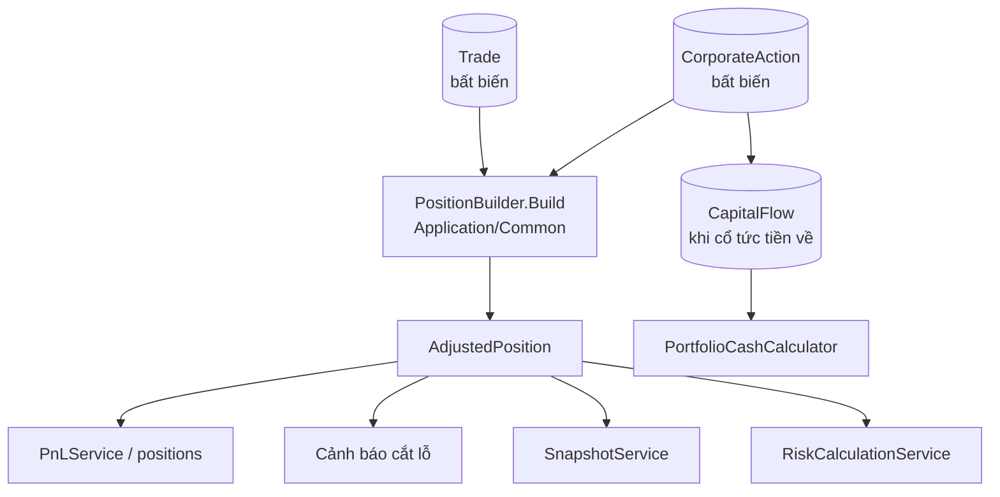

# Sự kiện quyền (cổ tức tiền mặt, cổ tức cổ phiếu, chia tách) & tính lại giá vốn / lãi lỗ

**Ngày:** 2026-08-08
**Trạng thái:** Chờ duyệt spec

## 1. Vấn đề

Danh mục thật có mã trả cổ tức đều (HPG ~30% cổ phiếu/năm, SAB ~5% tiền mặt/năm). App hiện **không** biết đến sự kiện quyền, dẫn tới:

1. **Lỗ giả tại ngày GDKHQ.** Giá tham chiếu bị điều chỉnh giảm ngay, nhưng cổ phiếu/tiền chỉ về tài khoản sau 1–2 tháng. Ví dụ 1.000 CP HPG giá vốn 25.000, giá thị trường 30.000, cổ tức CP 30%:

   | Mốc | SL app thấy | Giá TT | Giá trị | App hiển thị |
   |---|---|---|---|---|
   | Trước GDKHQ | 1.000 | 30.000 | 30,0tr | +20% ✅ |
   | Ngày GDKHQ | 1.000 | 23.077 | 23,1tr | −7,7% ❌ |
   | Sau ~40 ngày | 1.300 | 23.077 | 30,0tr | +20% ✅ |

   Giá trị vị thế **bốc hơi 23%** trong ~40 ngày dù không có gì xảy ra.

2. **Cảnh báo cắt lỗ kích hoạt nhầm.** `StopLossTarget` lưu giá tuyệt đối (`EntryPrice`, `StopLossPrice`, `TargetPrice`, `TrailingStopPrice`) — không điều chỉnh theo sự kiện quyền thì giá thị trường sau điều chỉnh sẽ xuyên thủng ngưỡng cắt lỗ ngay lập tức.

3. **Cổ tức tiền mặt không gắn với mã.** `CapitalFlowType.Dividend` đã tồn tại nhưng chỉ ở tầng tiền danh mục — không trả lời được "lãi thực của SAB gồm cả cổ tức là bao nhiêu". Mã trả cổ tức đều trông như **lỗ dần qua năm tháng**.

4. **Toán vị thế bị nhân bản.** Khoảng 15 service tự `GroupBy(t => t.Symbol)` trên `Trade` thô (`PnLService`, `PerformanceMetricsService`, `RiskCalculationService`, `SnapshotService`, `BacktestEngine`, `CashFlowAdjustedReturnService`, …). Thêm sự kiện quyền mà không gom về một chỗ → mỗi màn hình ra một con số giá vốn khác nhau.

5. **`Trade` không biểu diễn được sự kiện quyền.** Constructor ép `Quantity > 0` **và** `Price > 0` ([Trade.cs:29-30](../../../src/InvestmentApp.Domain/Entities/Trade.cs#L29-L30)) → cổ tức cổ phiếu (giá 0) và chia tách không thể là một `Trade`.

## 2. Quyết định đã chốt

| # | Quyết định | Lý do |
|---|---|---|
| Q1 | **Tính đúng từ giờ + màn hình nhập sự kiện lịch sử bằng tay.** Không viết script backfill tự động. | Script sửa dữ liệu quá khứ nhập sai thì không rollback được; nhập tay thì sửa/xoá chủ động. |
| Q2 | **Hybrid "chờ về".** Ghi nhận tại ngày GDKHQ, phần tăng thêm nằm ở trạng thái *chờ về* cho tới ngày thanh toán. | Lãi/lỗ đúng ngay, đồng thời vẫn giữ được con số khớp sổ công ty chứng khoán để đối chiếu. |
| Q3 | **Cổ tức tiền mặt = thu nhập, KHÔNG giảm giá vốn.** Cổ tức cổ phiếu / chia tách thì CÓ giảm giá vốn. | Đúng bản chất (nhận tiền ra ngoài vs. tổng vốn không đổi), khớp sổ CK và khớp cơ sở thuế TNCN 5%. |
| Kiến trúc | **`CorporateAction` (bất biến) + một `PositionBuilder` duy nhất.** `Trade` không bao giờ bị sửa. | Toán nằm một nơi → không lệch số giữa các màn hình; xoá sự kiện nhập sai = xoá một bản ghi. |

**Ràng buộc bắt buộc đi kèm Q3:** phải có cột **"Tổng lãi/lỗ gồm cổ tức"**. Không có cột này thì SAB sẽ hiển thị lỗ dần dù thực tế hoà vốn.

### Hướng đã cân nhắc và loại

- **Sửa thẳng trade cũ (rewrite history).** Không sửa service nào, đúng ngay — nhưng mất dữ liệu gốc, không rollback, lệch sổ CK vĩnh viễn.
- **Synthetic `Trade` (nới `Price > 0`).** Rẻ nhất, ~15 service tự đúng — nhưng mất lớp validate cho trade thật, `PortfolioCashCalculator` phải loại trừ (sai một chỗ là tiền mặt sai), và **không có chỗ lưu ngày GDKHQ vs ngày thanh toán** nên không làm được Q2.

### Ba điểm cần anh xác nhận ở vòng review spec

1. **`TradePlan` chỉ cảnh báo, không tự sửa** (mục 6.2) — kế hoạch là ý định của người dùng, app tự đổi giá vào/cắt lỗ dễ gây mất niềm tin.
2. **Cổ phiếu lẻ làm tròn xuống, phần lẻ bị huỷ** (mục 3.2) — đúng thông lệ phần lớn trường hợp ở VN, nhưng có doanh nghiệp trả tiền cho phần lẻ.
3. **Thuế TNCN cổ tức tiền mặt cố định 5%** (mục 3.1), cho phép sửa tay từng sự kiện.

## 3. Quy tắc nghiệp vụ

### 3.1 Cổ tức tiền mặt

**Bẫy đơn vị:** "cổ tức tiền mặt 5%" nghĩa là 5% của **mệnh giá 10.000đ** = 500đ/CP, *không* phải 5% giá thị trường.

```
AmountPerShare = Percent / 100 × 10.000          (nếu nhập theo %)
NetPerShare    = AmountPerShare × (1 − TaxRate)   TaxRate mặc định 5%
P_adj          = P_prev − AmountPerShare          (điều chỉnh theo số trước thuế)
```

- Giá vốn: **không đổi**.
- Ghi nhận ba con số: `DividendGross`, `DividendTax`, `DividendNet`.
- Entity **phải** lưu `AmountPerShare` đã quy đổi ra đồng. Không lưu mỗi số `5` — sớm muộn sẽ có chỗ nhân nhầm vào giá thị trường.

### 3.2 Cổ tức cổ phiếu và chia tách — cùng một phép toán

`RatioNew` là **tổng số cổ phiếu sau sự kiện**, không phải số cổ phiếu nhận thêm.

```
Multiplier  = RatioNew / RatioOld       cổ tức CP 30%  → 100:130 → 1,3
                                        "10:3" (thêm 3) → 10:13  → 1,3
                                        chia tách 1:2   → 1:2    → 2,0
QtyAfter    = floor(QtyBefore × Multiplier)     cổ phiếu lẻ bị huỷ
TotalCost   không đổi
AvgCost_new = TotalCost / QtyAfter
P_adj       = P_prev / Multiplier
```

Giao diện nhập cho phép gõ theo **%** (30%) hoặc theo **tỷ lệ nhận thêm** (10:3 — "cứ 10 CP cũ nhận thêm 3 CP"); cả hai quy về `RatioOld : RatioNew` dạng tổng khi lưu, kèm ô preview số lượng và giá vốn sau điều chỉnh.

### 3.3 Cùng một ngày GDKHQ có cả tiền mặt và cổ phiếu

Áp dụng **tiền mặt trước** (tính trên số lượng cũ), rồi mới nhân hệ số:

```
CashAmount = QtyBefore × AmountPerShare
P_adj      = (P_prev − AmountPerShare) / Multiplier
```

### 3.4 Trạng thái "chờ về" (Q2)

| Mốc | Xảy ra gì |
|---|---|
| `ExDate` | Giá vốn và **tổng số lượng** điều chỉnh ngay. Phần tăng thêm vào `PendingQuantity`. Tiền cổ tức vào `PendingDividend`. |
| `SettlementDate` (dự kiến) | Chỉ để hiển thị và nhắc. |
| `SettledAt` (người dùng bấm xác nhận) | `PendingQuantity` → `SettledQuantity`; `PendingDividend` → `DividendNet` **và** sinh `CapitalFlow` tương ứng. |

- `SettledQuantity` = con số khớp sổ công ty chứng khoán.
- `TotalQuantity = SettledQuantity + PendingQuantity` — dùng cho **mọi** phép tính P&L, rủi ro, snapshot.
- Tiền cổ tức chờ về **không** vào `PortfolioCashCalculator` (tiền chưa thật sự về ví), hiển thị riêng ở dòng "cổ tức chờ về".
- Bán quá `SettledQuantity`: **cảnh báo**, không chặn cứng (người dùng có thể đang nhập trade quá khứ).

## 4. Kiến trúc



### 4.1 `CorporateAction` — Domain

`src/InvestmentApp.Domain/Entities/CorporateAction.cs`, collection Mongo `corporate_actions`, field PascalCase.

| Trường | Kiểu | Ghi chú |
|---|---|---|
| `PortfolioId`, `UserId`, `Symbol` | `string` | `Symbol` tự `ToUpper().Trim()` như `Trade` |
| `Type` | `CorporateActionType` | `CashDividend` \| `StockDividend` \| `StockSplit` |
| `ExDate` | `DateTime` | Ngày GDKHQ — mốc điều chỉnh |
| `SettlementDate` | `DateTime?` | Ngày về dự kiến |
| `SettledAt` | `DateTime?` | Đã về thật (người dùng xác nhận) |
| `AmountPerShare` | `decimal?` | Đồng/CP, đã quy đổi. Chỉ với `CashDividend` |
| `TaxRatePercent` | `decimal?` | Mặc định 5 |
| `RatioOld`, `RatioNew` | `decimal?` | Chỉ với `StockDividend` / `StockSplit` |
| `DeclaredText` | `string` | Nguyên văn người dùng nhập ("30%", "10:3") để hiển thị |
| `CapitalFlowId` | `string?` | Link 1-1 khi cổ tức tiền đã sinh dòng tiền |
| `Note` | `string?` | |

Bất biến: sửa = xoá và tạo lại. Giữ đúng tinh thần "sự kiện là dữ kiện".

**Kiểm tra hợp lệ:**
- `CashDividend` → bắt buộc `AmountPerShare > 0`, cấm `RatioOld/RatioNew`.
- `StockDividend`/`StockSplit` → bắt buộc `RatioOld > 0`, `RatioNew > RatioOld`, cấm `AmountPerShare`.
- `SettlementDate >= ExDate` nếu có.

### 4.2 `PositionBuilder` — Application

`src/InvestmentApp.Application/Common/PositionBuilder.cs`, đặt cạnh `PortfolioCashCalculator.cs` theo đúng pattern sẵn có.

```csharp
public sealed record AdjustedPosition(
    string Symbol,
    decimal SettledQuantity,     // khớp sổ công ty chứng khoán
    decimal PendingQuantity,     // cổ phiếu chờ về
    decimal TotalQuantity,       // settled + pending — dùng cho mọi phép tính
    decimal AverageCost,         // đã điều chỉnh theo sự kiện quyền
    decimal TotalCost,
    decimal RealizedPnL,
    decimal DividendNet,         // cổ tức tiền đã nhận, sau thuế, luỹ kế
    decimal PendingDividend);    // cổ tức tiền chờ về, sau thuế

public static class PositionBuilder
{
    public static IReadOnlyList<AdjustedPosition> Build(
        IEnumerable<Trade> trades,
        IEnumerable<CorporateAction> actions,
        DateTime asOf);
}
```

**Thuật toán** — trộn `Trade` (mốc `TradeDate`) và `CorporateAction` (mốc `ExDate`) thành một chuỗi sự kiện, sắp theo ngày, chạy tuần tự trên state mỗi mã:

1. `BUY` → `SettledQuantity += q`; `TotalCost += q × p + Fee + Tax`
2. `SELL` → `RealizedPnL += q × (p − AvgCost) − Fee − Tax`; `TotalCost −= q × AvgCost`; `SettledQuantity −= q`
   *(`AvgCost = TotalCost / TotalQuantity` — tính trên cả phần chờ về, vì tổng vốn đã phân bổ cho cả phần đó)*
3. `CashDividend` tại `ExDate` → `PendingDividend += TotalQuantity × NetPerShare`. **Không** đụng `TotalCost`.
4. `StockDividend` / `StockSplit` tại `ExDate` → `newTotal = floor(TotalQuantity × Multiplier)`; `PendingQuantity += newTotal − TotalQuantity`. **`TotalCost` không đổi** → `AvgCost` tự động giảm.
5. Nếu `SettledAt != null && asOf >= SettledAt` → chuyển `Pending*` sang `Settled*` / `DividendNet`.

Hàm thuần, không I/O, không phụ thuộc repository → test trực tiếp bằng xUnit, không cần Moq.

### 4.3 Điều chỉnh giá ngưỡng — `CorporateActionAdjuster`

```csharp
decimal AdjustPrice(decimal price, IEnumerable<CorporateAction> actionsAfter);
```

Áp `(price − AmountPerShare) / Multiplier` cho từng sự kiện có `ExDate` sau thời điểm đặt ngưỡng. Dùng **tại thời điểm đọc**, không sửa dữ liệu → xoá sự kiện thì ngưỡng tự quay về cũ.

### 4.4 Thay đổi `CapitalFlow`

Thêm hai trường nullable: `Symbol`, `CorporateActionId`. Dòng tiền cổ tức được **sinh ra từ** `CorporateAction` khi bấm xác nhận đã về, không nhập tay song song.

**Rủi ro đếm hai lần:** dữ liệu cũ đã có `CapitalFlow.Dividend` nhập tay. Vì Q1 không backfill, các dòng cũ giữ nguyên. Chặn bằng cảnh báo: khi xác nhận một `CashDividend`, nếu tồn tại `CapitalFlow.Dividend` cùng danh mục trong khoảng ±7 ngày quanh `SettlementDate` mà chưa có `CorporateActionId`, hiện cảnh báo và cho chọn *liên kết dòng cũ* thay vì tạo mới.

## 5. API

| Method | Route | Ghi chú |
|---|---|---|
| `GET` | `/portfolios/{portfolioId}/corporate-actions` | Lọc theo `symbol`, `from`, `to` |
| `POST` | `/portfolios/{portfolioId}/corporate-actions` | Trả về preview số lượng / giá vốn sau điều chỉnh |
| `DELETE` | `/corporate-actions/{id}` | |
| `POST` | `/corporate-actions/{id}/settle` | Xác nhận đã về; body có `settledAt` |

Mọi handler kiểm tra quyền sở hữu **theo chuỗi**: `portfolio.UserId == request.UserId` **và** `corporateAction.PortfolioId == portfolio.Id`. Không tin `PortfolioId` do client gửi.

## 6. Phạm vi

### 6.1 Phase 1 — năm điểm dùng số để ra quyết định

| # | Nơi sửa | Vì sao gấp |
|---|---|---|
| 1 | `PnLService` + `positions` | Giá vốn và lãi/lỗ nhìn hằng ngày |
| 2 | Cảnh báo cắt lỗ (`StopLossTarget`) | Đang kích hoạt nhầm vì lỗ giả 23% |
| 3 | `SnapshotService` | Equity curve, drawdown |
| 4 | `RiskCalculationService` | VaR / Sharpe |
| 5 | `PortfolioCashCalculator` | Cổ tức tiền phải vào tiền mặt |

### 6.2 Ngoài phạm vi phase 1

- `BacktestEngine`, `BehavioralAnalysisService`, `StrategyPerformanceService`, `CampaignReviewService`, `DisciplineScoreCalculator` — sai/đúng không làm mất tiền hôm nay.
- **`TradePlan` chỉ cảnh báo, không tự sửa.** Kế hoạch đang mở mà có sự kiện quyền chưa xử lý → hiện badge "kế hoạch chưa điều chỉnh theo sự kiện quyền" kèm nút gợi ý giá mới, người dùng tự bấm áp dụng.
- Tự động lấy sự kiện từ 24hmoney (`/api/v2/web/announcement/dividend-events`) — **phase 2**.
- Quyền mua ưu đãi (`RightsIssue`), cổ phiếu thưởng từ thặng dư, sáp nhập/hoán đổi.
- Điều chỉnh dữ liệu giá lịch sử (`StockPrice`) — biểu đồ giá vẫn hiển thị giá thô.

## 7. Giao diện

- Tab **"Sự kiện quyền"** trong trang chi tiết danh mục + màn hình nhập.
- Form nhập: mã (dùng `appUppercase`), loại, ngày GDKHQ, ngày về dự kiến, tỷ lệ hoặc số tiền, **ô preview tính realtime** ("1.000 CP → 1.300 CP, giá vốn 25.000 → 19.231").
- Danh sách vị thế: badge `+300 chờ về`, tooltip ghi ngày dự kiến.
- Bảng lãi/lỗ thêm hai cột: **"Cổ tức đã nhận"** và **"Tổng lãi/lỗ gồm cổ tức"**.
- Nút **"Xác nhận đã về"** trên từng sự kiện đang chờ.
- Thứ tự nút trong modal: `[Hủy]` → `[Xoá]` → `[Lưu]` (primary bên phải). Overlay `z-[60]`.
- Toàn bộ chữ tiếng Việt có dấu đầy đủ.

## 8. Trường hợp biên

| Tình huống | Xử lý |
|---|---|
| Sự kiện có `ExDate` trước trade đầu tiên của mã | Bỏ qua — chưa sở hữu thì không hưởng quyền |
| Bán hết trước `ExDate` | Bỏ qua, `TotalQuantity = 0` |
| `TotalQuantity = 0` khi tính `AvgCost` | Trả `AvgCost = 0`, không chia cho 0 |
| Bán một phần trước `ExDate` | Chỉ phần còn giữ được hưởng — thuật toán tuần tự tự xử lý đúng |
| Cổ phiếu lẻ (137 × 1,3 = 178,1) | `floor` → 178; `TotalCost` giữ nguyên nên giá vốn nhích lên chút |
| Nhiều sự kiện cùng `ExDate` | Tiền mặt trước, rồi cổ phiếu (mục 3.3) |
| Xoá sự kiện | Mọi con số tự tính lại — không có dữ liệu nào bị sửa vĩnh viễn |
| `SettlementDate` đã qua mà chưa xác nhận | Vẫn ở trạng thái chờ; hiện nhắc "đã quá ngày dự kiến, kiểm tra tài khoản?" |

## 9. Kiểm thử

TDD, viết test trước.

**`InvestmentApp.Domain.Tests`** — validate `CorporateAction`: thiếu `AmountPerShare` với `CashDividend`, `RatioNew <= RatioOld`, `SettlementDate < ExDate`.

**`InvestmentApp.Application.Tests` — `PositionBuilderTests`** (hàm thuần, không Moq):

| Test | Kỳ vọng |
|---|---|
| HPG 1.000 CP giá vốn 25.000, cổ tức CP 30% | `Total = 1.300`, `Pending = 300`, `AvgCost = 19.230,77`, `TotalCost` không đổi |
| Cùng dữ liệu, `asOf` sau `SettledAt` | `Settled = 1.300`, `Pending = 0` |
| SAB 1.000 CP, cổ tức tiền 5% (500đ/CP) | `PendingDividend = 475.000`, `AvgCost` **không đổi** |
| Chia tách 1:2 | Số lượng ×2, giá vốn ÷2, `TotalCost` không đổi |
| Cùng ngày cả tiền mặt lẫn cổ phiếu | Tiền tính trên số lượng cũ, rồi mới nhân hệ số |
| 137 CP × 1,3 | 178 CP, không phải 178,1 |
| Bán 500 CP trước `ExDate` | Chỉ 500 CP còn lại được hưởng quyền |
| Sự kiện trước trade đầu tiên | Không ảnh hưởng |
| Xoá sự kiện | Kết quả bằng đúng lúc chưa có sự kiện |

**`CorporateActionAdjusterTests`** — giá cắt lỗ 22.000 sau cổ tức CP 30% → 16.923.

**Frontend** — spec cho ô preview và badge "chờ về".

## 10. Rủi ro

| Rủi ro | Giảm thiểu |
|---|---|
| Sửa 5 call-site làm lệch số ở màn hình khác | Mỗi call-site một commit riêng, chạy lại test cũ trước khi sang cái tiếp theo |
| Đếm hai lần cổ tức tiền (dòng cũ nhập tay) | Cảnh báo ±7 ngày + cho liên kết dòng cũ (mục 4.4) |
| Nhập sai tỷ lệ | Ô preview realtime trước khi lưu; sự kiện bất biến, xoá được, không sửa dữ liệu gốc |
| `PositionBuilder` chậm với danh mục nhiều trade | Hàm thuần, không I/O; cache theo `(portfolioId, asOf)` nếu đo thấy chậm — chưa tối ưu sớm |

## 11. Cần ghi ADR

Có — đổi schema (`CorporateAction`, thêm trường cho `CapitalFlow`) và đổi contract cross-layer (~15 service đổi nguồn tính vị thế). Viết trong `docs/adr/0010-corporate-actions-position-projection.md`, ghi lại lý do loại hướng "synthetic Trade" và hướng "rewrite history".
