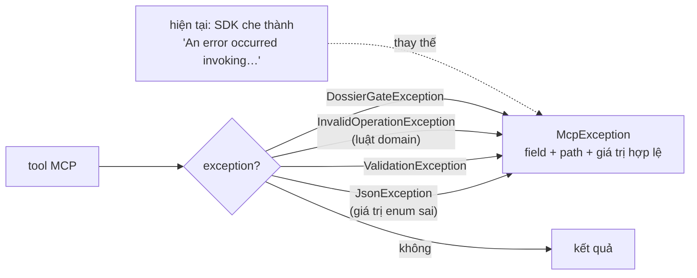

# Hợp đồng MCP tự mô tả cho cây kịch bản kế hoạch giao dịch

**Ngày:** 2026-08-11
**Trạng thái:** Đã chốt thiết kế, chờ hiện thực
**Phạm vi:** Backend (`InvestmentApp.Application` + `InvestmentApp.Api`). Không chạm frontend.

## Bảng thuật ngữ

| Viết tắt | Tên đầy đủ | Nghĩa trong tài liệu này |
|---|---|---|
| MCP | Model Context Protocol | Giao thức để AI agent gọi tool của backend |
| SDK | Software Development Kit | Thư viện `ModelContextProtocol.AspNetCore` 2.0.0-rc.1 |
| DTO | Data Transfer Object | Lớp chở dữ liệu qua ranh giới (ở đây: tham số tool và kết quả query) |
| STJ | System.Text.Json | Bộ tuần tự JSON của .NET |
| FE | Frontend | Ứng dụng Angular |
| `inputSchema` | — | Phần mô tả tham số của một tool, agent nhận được ở lời gọi `tools/list` |

## 1. Bối cảnh

Ngày 11/08/2026 một phiên làm việc cố ghi cây kịch bản (`scenarioNodes`) vào kế hoạch giao dịch qua MCP và thất bại lặp lại với thông báo `An error occurred invoking 'update_trade_plan'`. Phiên đó kết luận: enum `actionType` chỉ chấp nhận `SellAll`, và `trailingStopConfig` làm hỏng deserialize.

**Cả hai kết luận đều sai.** Đã xác thực bằng 10 test chạy qua `CreateTradePlanCommandHandler` thật:

- Enum `ScenarioActionType` có 7 giá trị: `SellPercent`, `SellAll`, `MoveStopLoss`, `MoveStopToBreakeven`, `ActivateTrailingStop`, `AddPosition`, `SendNotification`.
- `trailingStopConfig` chỉ có `trailValue` ghi thành công, `method` tự về `Percentage`.
- Các tên đã thử — `Buy`, `Sell`, `TakeProfit`, `Hold`, `TrailingStop`, `ScaleIn` — **không tồn tại** trong enum, nên `Enum.Parse` ném `ArgumentException`. `SellAll` chạy được chỉ vì tình cờ đoán trúng.

### Nguyên nhân gốc thật

Agent chỉ giao tiếp qua MCP. Nó **không đọc** `src/InvestmentApp.Api/Docs/AI-Agent-TradePlan-API.md`, nơi đã liệt kê đủ 7 giá trị từ trước. Thứ nó thực sự nhận được là `inputSchema`, và ở đó `scenarioNodes` là một object trần không một chữ hướng dẫn:

```
{nodeId: string, parentId: string?, order: int, label: string,
 conditionType: string, conditionValue: number?, actionType: string, …}
```

Không có `[Description]` nào trên property DTO trong toàn lớp Application. Đối chiếu: các tham số **phẳng** như `direction`, `timeHorizon` có `[Description]` và ghi rõ giá trị hợp lệ — agent tuân đúng những chỗ đó. Nó đoán ở đúng những chỗ không được cho biết.

Đây là khiếm khuyết của mặt tiếp xúc, không phải lỗi của bên gọi. Tài liệu cho người đọc không thay thế được hợp đồng máy đọc.

## 2. Nguyên tắc

> Mọi tham số MCP nhận giá trị thuộc một tập hữu hạn thì tập đó phải nằm trong `inputSchema`.

Hệ quả: hướng dẫn dùng tool không được sống ở tài liệu ngoài luồng, một tool tra cứu phải gọi thêm, hay tri thức của người viết prompt. Nó sống trong chính schema mà agent đã nhận miễn phí ở `tools/list`.

## 3. Kết quả xác thực SDK

Ba ẩn số quyết định thiết kế, đã chốt bằng thực nghiệm trên `ModelContextProtocol` 2.0.0-rc.1:

| Câu hỏi | Kết quả |
|---|---|
| SDK có sinh `"enum":[…]` cho property enum **lồng trong DTO**? | **Có** — và giữ nguyên `[Description]` cạnh nó |
| SDK có sinh `"enum":[…,null]` cho tham số **phẳng** kiểu `TEnum?` | **Có** |
| `McpJsonUtilities.DefaultOptions` có `JsonStringEnumConverter`? | **Có** — chuỗi→enum bind bình thường trên đường MCP |
| Giá trị enum sai thì lỗi ra sao? | `JsonException`, nêu đúng tên type và JSON path |
| `AllowedValuesAttribute` có sinh ràng buộc `enum` trong schema? | **Không** — nó phục vụ `completion/complete`, agent đọc `tools/list` rồi gọi luôn sẽ không bao giờ thấy |

Mẫu schema thu được từ probe:

```json
"actionType": {
  "description": "Hành động khi điều kiện chạm.",
  "type": "string",
  "enum": ["SellPercent","SellAll","MoveStopLoss","MoveStopToBreakeven",
           "ActivateTrailingStop","AddPosition","SendNotification"]
}
```

**Bẫy đã phát hiện:** tham số phẳng kiểu enum khai **không có `= null`** bị SDK xếp vào `"required"`. Mọi tham số enum tùy chọn buộc phải khai `= null`.

## 4. Thiết kế

Bốn mục. Mục 1 giải quyết vấn đề; mục 2–4 là lưới an toàn cho phần agent vẫn sai.

### Mục 1 — Schema tự mô tả

Đổi mọi field có tập giá trị hữu hạn từ `string` sang enum miền thật, kèm `[Description]` mang phần ngữ nghĩa mà `enum` không diễn đạt được (ví dụ `AddPosition` = mua thêm % vị thế).

| Nơi áp | Field |
|---|---|
| `ScenarioNodeDto` | `conditionType`, `actionType`, `status` |
| `TrailingStopConfigDto` | `method` |
| `ExitTargetDto` | `actionType` |
| `PlanLotDto` | `status` |
| `InvalidationRuleDto` | `trigger` |
| Tham số phẳng của tool | `timeHorizon`, `entryMode`, `exitStrategyMode` |

Tương thích ngược với FE: `JsonStringEnumConverter` đã đăng ký ở `ApiJsonConfig` cho đường MVC, nên enum vào/ra vẫn là chuỗi. Kiểu TypeScript của FE khai `string` — không đổi.

Với các field có tập hữu hạn nhưng **không có** enum miền tương ứng — `direction` và `marketCondition` là `string` thuần trên `TradePlan`, `status` của `set_trade_plan_status` cũng vậy: giữ `string`, ghi tập giá trị vào `[Description]`, và thêm `[AllowedValues]` để client tương tác có gợi ý. `[AllowedValues]` **không** được tính là đã thỏa nguyên tắc mục 2 — nó không tới được agent đọc schema.

### Mục 2 — Quyết định không có mặc định ngầm

`ActionType` và `ConditionType` khai **nullable** (`ScenarioActionType?`) + validator bắt `NotNull`.

Lý do phải nullable: nếu khai non-nullable, một node gửi thiếu `actionType` sẽ nhận `default(enum)` = `SellPercent` — **đúng lại cái bẫy đang có hôm nay**, chỉ đổi thủ phạm từ property initializer sang CLR. Hiện tại `ScenarioNodeDto` đặt `ActionType = "SellPercent"` và `ConditionType = "PriceAbove"` làm giá trị khởi tạo, nên node thiếu `actionType` im lặng trở thành *"bán 50% vị thế"* với `actionValue = null`.

`Method` khai `TrailingStopMethod?` với `?? Percentage` trong handler.

Ranh giới: **hành động là quyết định, không được có mặc định ngầm; đơn vị đo thì được.**

### Mục 3 — Lỗi tự chữa

Điểm móc là **filter cấp server** (`McpServerOptions.Filters.Request.CallToolFilters`), không phải bọc thân từng tool. Lý do đo được, không suy luận: sau khi mục 1 siết kiểu, giá trị enum sai vỡ ở bước SDK marshal tham số (`AIFunctionFactory.GetParameterMarshaller`) — tức **trước** khi thân tool chạy. Bọc thân tool không nằm trên đường đi của đúng ca lỗi cần đỡ nhất. Nghịch lý đáng ghi: chính việc siết kiểu ở mục 1 đẩy lỗi lên sớm hơn chỗ một helper bọc-thân với tới được.

Helper bọc thân (`RunAsync`) vẫn giữ cho lỗi phát sinh trong thân tool; `McpDossierGate` gộp vào đó thay vì tồn tại song song. Filter là lớp ngoài cùng bắt mọi thứ còn lại.

Với `JsonException`, message của STJ nói được "sai ở đâu" (type + JSON path) nhưng không nói "gửi gì cho đúng". Đọc tên enum từ message rồi nối tập giá trị vào — agent tự sửa trong một lượt thay vì đoán từng tên.



Chỉ `McpException` đi xuyên qua được lớp che của SDK. Mọi exception khác bị nuốt thành chuỗi chung vô nghĩa — kể cả những message vốn viết rất tốt, ví dụ `"Trigger không hợp lệ — phải là một trong: EarningsMiss, TrendBreak, …"` trong `CreateTradePlanCommandValidator` hiện cũng đang bị che y hệt.

Filter phủ toàn bộ tool nên không cần test quét từng tool. Thay vào đó cần một test khẳng định filter **được cắm vào** — filter đúng mà không đăng ký thì vô nghĩa, và test đi qua filter thủ công sẽ không phát hiện ra.

### Mục 4 — Xóa guard đang bóp chết luật domain

`TradePlan.SetScenarioNodes` **đã** có đúng luật cần thiết:

```csharp
if (ExitStrategyMode != ExitStrategyMode.Advanced)
    throw new InvalidOperationException("Cannot set scenario nodes in Simple mode");
```

Nhưng `UpdateTradePlanCommandHandler` có vế `&& plan.ExitStrategyMode == ExitStrategyMode.Advanced` khiến dòng đó **không bao giờ chạy tới được** — `scenarioNodes` rơi im lặng và tool trả về `"ok"`. Đường tạo cũng vậy: nodes chỉ được áp bên trong nhánh `Advanced`.

Luật không thiếu; nó đang bị một câu `if` phòng thủ bóp chết. Sửa = bỏ vế đó, để domain ném, và mục 3 tải message ra ngoài.

Đường hợp lệ không đổi: plan đã ở `Advanced`, caller chỉ gửi `scenarioNodes` → vẫn ghi bình thường.

## 5. Tiêu chí nghiệm thu

Một test end-to-end buộc bốn mục chứng minh lẫn nhau: gọi `tool.InvokeAsync` với `actionType: "Buy"` và assert message nhận được **nêu đủ 7 giá trị hợp lệ**. Mục nào hụt thì test đỏ.

Ngoài ra:

- `inputSchema` của `create_trade_plan` và `update_trade_plan` chứa mảng `enum` cho từng field ở bảng mục 1 — assert trên `InputSchema.GetRawText()` thô, không qua lớp bọc nào.
- Node thiếu `actionType` → lỗi, không im lặng thành `SellPercent`.
- `trailingStopConfig` chỉ có `trailValue` → ghi được, `method` = `Percentage`.
- `trailingStopConfig` có `method: null` tường minh → ghi được, `method` = `Percentage`.
- `scenarioNodes` gửi khi chế độ hiệu dụng là `Simple` → lỗi nêu rõ cách chữa, không trả `"ok"`.
- Plan đã `Advanced`, chỉ gửi `scenarioNodes` → vẫn ghi bình thường (không hồi quy).
- Không tham số tùy chọn nào bị đẩy vào `"required"` của schema.

## 6. Phần cố ý không làm

- **Không** thêm tool MCP để agent tra cứu tài liệu. Hướng dẫn phải nằm trong schema, không phải sau một lời gọi nữa.
- **Không** tự nâng plan lên `Advanced` khi thấy `scenarioNodes`. Đổi ngầm trạng thái sẽ làm màn hình kế hoạch đổi bố cục mà người dùng không yêu cầu.
- **Không** trả chuỗi cảnh báo kèm `"ok"`. Agent đọc `"ok"` rồi báo hoàn thành, trong khi kế hoạch vẫn rỗng kịch bản — vẫn là thất bại âm thầm, chỉ ồn hơn.
- **Không** mở rộng `ScenarioActionType`. Enum đã đủ diễn đạt ý định: mua thêm → `AddPosition`, trailing → `ActivateTrailingStop`, chốt lời từng phần → `SellPercent`.

## 7. Ghi chú còn treo

`exitTargets.actionType` (`TakeProfit`/`CutLoss`/`TrailingStop`/`PartialExit`) và `scenarioNodes.actionType` (7 giá trị khác) là **hai enum khác nhau cùng tên `actionType`** — gần như chắc chắn là nguồn gốc của các lần đoán sai. Sau mục 1, cả hai đều mang `enum` riêng trong schema nên agent phân biệt được. Việc đổi tên cho hết nhập nhằng là thay đổi phá vỡ hợp đồng FE, để riêng, không gộp vào lần này.
