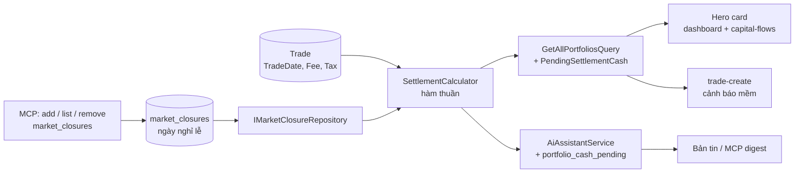

# Tiền bán chờ về T+2 — tách khỏi tiền mặt khả dụng

**Ngày:** 2026-08-12 · **Trạng thái:** đã duyệt thiết kế, chưa thi hành

## 0. Thuật ngữ

| Viết tắt | Tên đầy đủ | Nghĩa ở đây |
|---|---|---|
| T+2 | Trade date plus two | Tiền bán chứng khoán về tài khoản sau **2 phiên giao dịch** kể từ ngày khớp lệnh |
| HOSE | Ho Chi Minh Stock Exchange | Sở Giao dịch Chứng khoán TP.HCM — nơi công bố lịch nghỉ giao dịch |
| VSD | Vietnam Securities Depository | Tổng công ty Lưu ký và Bù trừ — cơ quan thực hiện thanh toán |
| CTCK | Công ty chứng khoán | Nơi giữ tài khoản, là sổ để đối chiếu số liệu |
| GDKHQ | Giao dịch không hưởng quyền | Ngày mua vào không còn được hưởng quyền của sự kiện quyền |
| MCP | Model Context Protocol | Giao thức để trợ lý AI gọi tool của app |
| DTO | Data Transfer Object | Lớp dữ liệu truyền qua API, không phải entity |
| Ứng trước tiền bán | — | Dịch vụ CTCK cho dùng tiền bán trước ngày về, có phí |

## 1. Vấn đề

Chứng khoán Việt Nam thanh toán theo chu kỳ **T+2**: bán hôm nay thì tiền về tài khoản sau 2 phiên giao dịch. App hiện **cộng tiền bán vào tiền mặt ngay tại ngày khớp lệnh**, nên "Tiền mặt khả dụng" cao hơn thực tế tới 2 phiên — và đó chính là con số dùng để quyết định vào lệnh mới.

| Bước | Sự thật | Bằng chứng |
|---|---|---|
| 1 | `PortfolioCashCalculator` cộng `grossSells` không xét ngày thanh toán | [PortfolioCashCalculator.cs:25-28](../../../src/InvestmentApp.Application/Common/PortfolioCashCalculator.cs#L25-L28) |
| 2 | `PortfolioSummaryDto.TotalSold` cũng gộp mọi lệnh SELL bất kể ngày | [GetAllPortfoliosQuery.cs:43-45](../../../src/InvestmentApp.Application/Portfolios/Queries/GetAllPortfolios/GetAllPortfoliosQuery.cs#L43-L45) |
| 3 | Hero card của `/dashboard` và `/capital-flows` tính `cashBalance = currentCapital − totalInvested + totalSold` từ số ở bước 2 | [dashboard.component.ts:737-739](../../../frontend/src/app/features/dashboard/dashboard.component.ts#L737-L739) · [capital-flows.component.ts:409](../../../frontend/src/app/features/capital-flows/capital-flows.component.ts#L409) |
| 4 | Bản tin AI in `<portfolio_cash>` từ số ở bước 1, và đó là **nền tính khối lượng vị thế** | [AiAssistantService.cs:1983](../../../src/InvestmentApp.Infrastructure/Services/AiAssistantService.cs#L1983) · [dòng 2153](../../../src/InvestmentApp.Infrastructure/Services/AiAssistantService.cs#L2153) |
| 5 | Cửa sổ ghi lệnh MUA chặn theo `remainingCash` cũng gồm tiền chưa về | [trade-create.component.ts:483](../../../frontend/src/app/features/trades/trade-create/trade-create.component.ts#L483) |
| 6 | Codebase **không có** helper lịch phiên nào — chỉ vài chỗ bỏ T7/CN rời rạc | [BacktestEngine.cs:97](../../../src/InvestmentApp.Infrastructure/Services/BacktestEngine.cs#L97) |

Hệ quả thực tế: bán xong, mở dashboard thấy đủ tiền, lập kế hoạch mua bằng số tiền đó — trong khi CTCK chưa cho dùng (trừ khi trả phí ứng trước tiền bán). Cùng hình dạng lỗi với sự cố lỗ giả 23% mà [ADR-0010](../../adr/0010-corporate-actions-position-projection.md) đã xử lý cho sự kiện quyền: **màn hình có con số, người đọc tin là đúng, và không có gì nói cho biết là chưa**.

`RiskCalculationService` và `SnapshotService` **không** nằm trong vấn đề này: chúng dùng `− TotalInvested`, vốn dĩ không cộng tiền bán. [ADR-0007](../../adr/0007-portfolio-cash-formula-divergence.md) vẫn giữ nguyên hiệu lực.

## 2. Quyết định

| # | Quyết định | Vì sao |
|---|---|---|
| Q1 | **Không sửa `PortfolioCashCalculator`.** Tính thêm một đại lượng riêng `PendingSettlementCash`, số tổng giữ nguyên. | Công thức đó bị ADR-0007 ghim và dùng chung với `CashFlowAdjustedReturnService`; đổi nó là đổi luôn TWR. Thêm một đại lượng thì không ai đang đọc số cũ bị lệch. |
| Q2 | **Hàm thuần, không persist ngày thanh toán vào `Trade`.** | `SettlementDate` suy ra được từ `TradeDate`. Lưu vào aggregate là dữ liệu trùng lặp, cần migration cho mọi trade cũ, và khi lịch nghỉ được sửa thì số đã ghi không hồi tố được. |
| Q3 | **Lịch nghỉ lễ nằm trong DB, không hardcode.** Nhập qua endpoint + MCP, một bản ghi cho một ngày. | Lịch đổi mỗi năm. Hardcode nghĩa là mỗi năm một PR + một lần deploy chỉ để thêm 12 dòng dữ liệu. |
| Q4 | **Chỉ lưu ngày nghỉ lễ. T7/CN suy ra từ `DayOfWeek`.** | 104 bản ghi cuối tuần mỗi năm không mang thêm thông tin nào. |
| Q5 | **Nhập theo từng ngày, gửi được cả mảng.** Có xoá từng ngày. | Lịch cả năm nhiều khi chưa chốt và thông báo lễ ra lẻ từng đợt — nhập được ngay khi có tin, mà vẫn nhập một lượt cả năm khi đã đủ. Xoá để sửa khi nghị định đổi hoặc nhập nhầm. |
| Q6 | **Về trong ngày T+2, không mô hình hoá mốc thanh toán ~11:30 của VSD.** | Sai lệch nửa ngày. Thêm chiều thời gian vào mọi phép so sánh để đổi lấy nửa ngày là không đáng, nhất là khi `TradeDate` trong Mongo đã có bản ghi cũ không còn là nửa đêm. |
| Q7 | **Cửa sổ ghi lệnh MUA chỉ cảnh báo mềm, không chặn.** | Form đó ghi lệnh **đã khớp**. Chặn cứng theo tiền đã về sẽ không cho ghi lệnh thật đã thực hiện bằng dịch vụ ứng trước tiền bán — tức là app từ chối ghi nhận hiện thực. |
| Q8 | **Hiện luôn ngày về dự kiến cạnh số tiền chờ về.** | Khi lịch nghỉ chưa nhập đủ, không có cách nào phát hiện "thiếu" nếu chỉ lưu từng ngày. Phơi giả định ra để soát được, thay vì chôn nó trong một con số. |
| Q9 | **Lịch nghỉ gắn `UserId`.** | Về bản chất là dữ liệu dùng chung, nhưng để global thì thành endpoint mà một người ghi làm đổi số của người khác. App solo — chọn user-scoped cho khớp mọi entity còn lại và không mở lỗ hổng đó. |

## 3. Thành phần mới

| File | Vai trò | Giao diện công khai |
|---|---|---|
| `Domain/Entities/MarketClosure.cs` | Một ngày HOSE đóng cửa | `Date`, `Note`, `UserId`, `CreatedAt` |
| `Application/Common/SettlementCalculator.cs` | Hàm thuần, không I/O | `SettlementDateOf(DateTime tradeDate, IReadOnlySet<DateOnly> closedDates)`<br>`PendingSellProceeds(IEnumerable<Trade>, DateTime asOf, IReadOnlySet<DateOnly> closedDates)` |
| `IMarketClosureRepository` | Trong `RepositoryInterfaces.cs`, impl Mongo ở Infrastructure | `GetByUserIdAsync(userId, from, to, ct)`<br>`UpsertManyAsync(closures, ct)`<br>`DeleteAsync(userId, date, ct)` |

`closedDates` được **truyền vào** hàm thuần, do caller nạp từ repository. Nhờ vậy `SettlementCalculator` vẫn test được không cần DB, đúng khuôn `PositionBuilder` / `PortfolioCashCalculator` đang dùng.

## 4. Lịch nghỉ trong DB

Collection `market_closures`, unique index `(UserId, Date)` → nhập trùng là no-op, không phải lỗi. Theo đúng khuôn dedup đã dùng ở repo này: unique index + bắt `DuplicateKey` thành no-op ở tầng repository.

| Đường | Mô tả |
|---|---|
| `POST /api/v1/market-closures` | Body `{ dates: ["2026-04-27", …], note?: "Giỗ Tổ Hùng Vương" }`. Nhận 1 ngày, 1 đợt lễ, hay cả năm — cùng một endpoint. Idempotent |
| `DELETE /api/v1/market-closures/{date}` | Xoá một ngày |
| `GET /api/v1/market-closures?year=2026` | Trả **nhóm theo tháng**, ghi chú theo từng ngày: `{ year: 2026, months: [{ month: 4, days: [{ day: 27, note: "Giỗ Tổ Hùng Vương" }, { day: 30, note: "Ngày Chiến thắng" }] }, … ] }`. Ghi chú phải ở cấp ngày, không phải cấp tháng — tháng 4/2026 có hai đợt lễ khác nhau |

Cả ba đường đều có sibling controller cho scheme `ApiKey` (khuôn `AiAgentControllerBase` đang dùng trong repo) và tool MCP tương ứng:

- `list_market_closures(int year)`
- `add_market_closures(string[] dates, string? note = null)`
- `remove_market_closure(string date)`

Tham số **phẳng**, không bọc trong object command — kiểu tham số phức hợp làm schema lồng một cấp và mọi lời gọi phẳng đều fail giống nhau.

**Seed:** `scripts/migrations/2026-08-12-market-closures-2026.mongo.js` nạp 12 ngày nghỉ 2026 do HOSE công bố, để tính đúng ngay từ lần chạy đầu:

| Đợt | Ngày |
|---|---|
| Tết Dương lịch | 01/01 |
| Tết Nguyên đán Bính Ngọ | 16/02 – 20/02 |
| Giỗ Tổ Hùng Vương | 27/04 |
| Ngày Chiến thắng + Quốc tế Lao động | 30/04 – 01/05 |
| Quốc khánh | 31/08 – 02/09 |

Tổng 12 phiên, khớp thông báo lịch nghỉ giao dịch 2026 của HOSE. T7 22/08/2026 là ngày làm việc bù nhưng HOSE không giao dịch — T7 đã bị loại theo `DayOfWeek` nên không cần ghi.

## 5. Quy ước tính

- **Ngày về** = `TradeDate` + 2 phiên giao dịch, phiên là ngày không phải T7/CN và không nằm trong `market_closures`.
- **Tiền chờ về** = `Σ (Quantity × Price − Fee − Tax)` của các lệnh SELL có ngày về `> hôm nay`. Định nghĩa này trùng khít `TotalSold`, nên bất biến **`đã về + chờ về = TotalSold`** luôn giữ — sẽ ghim thành test.
- **"Hôm nay" là ngày theo giờ Việt Nam (UTC+7)**, không phải `DateTime.UtcNow.Date`. Từ 00:00 đến 07:00 giờ Việt Nam thì ngày UTC vẫn là hôm trước, dùng nó sẽ giữ tiền ở trạng thái chờ về thêm một ngày. Quy đổi một lần ở tầng gọi, truyền `asOf` đã là ngày Việt Nam vào hàm thuần.
- So sánh `.Date` cả hai vế, như `PositionBuilder` đã làm: bản ghi Mongo cũ có thể không còn là nửa đêm.
- `closedDates` là `IReadOnlySet<DateOnly>`; `TradeDate` là `DateTime` nên quy đổi `DateOnly.FromDateTime(d.Date)` **bên trong** hàm thuần, caller không phải tự lo.
- Lệnh BUY không tạo tiền chờ về (đây là phạm vi tiền, không phải phạm vi cổ phiếu — xem §8).
- **Ngày về hiển thị** là ngày về **xa nhất** trong các lệnh còn chờ — tức mốc toàn bộ tiền chờ về đã về đủ.

**Golden test lấy thẳng từ thông báo HOSE:** giao dịch ngày **12/02/2026 thanh toán 23/02**, giao dịch ngày **13/02/2026 thanh toán 24/02** (do nghỉ Tết 16–20/02). Hai ca này chạy trong `SettlementCalculatorTests` với tập ngày nghỉ **truyền thẳng trong test**, giữ hàm thuần không cần DB; một test riêng khẳng định script seed chứa đúng 12 ngày đó, để hai nguồn không lệch nhau.

## 6. Luồng dữ liệu



`GetAllPortfoliosQuery` đã load sẵn toàn bộ trade của từng danh mục, nên chỉ thêm **một** truy vấn nhẹ cho lịch nghỉ. Không cache: app một người dùng, document rất bé — bỏ qua có ý thức, không phải sót.

## 7. Ba bề mặt hiển thị

**Hero card `/dashboard` + `/capital-flows`** — số lớn giữ nguyên là **tổng** (không đổi hành vi đang có), thêm dòng nhỏ bên dưới theo đúng khuôn "chờ về" của sự kiện quyền ở [positions.component.ts:150](../../../frontend/src/app/features/positions/positions.component.ts#L150):

```
Tiền mặt khả dụng
120.000.000 đ
trong đó 30.000.000 đ chờ về — dự kiến 24/02      ← chỉ hiện khi > 0
```

**Bản tin AI** — thêm `<portfolio_cash_pending>` và `<market_closures_known_through>` (ngày nghỉ xa nhất đã nhập) vào section tiền/net-worth; sửa dòng hướng dẫn ở [AiAssistantService.cs:2153](../../../src/InvestmentApp.Infrastructure/Services/AiAssistantService.cs#L2153) để advisor trừ phần chờ về khi gợi ý khối lượng. Thiếu trades → in `n/a`, **không in `0`** — giữ nguyên nguyên tắc đã có của section này ([dòng 107](../../../src/InvestmentApp.Infrastructure/Services/AiAssistantService.cs#L107)).

**Cửa sổ ghi lệnh MUA** — gate cứng theo tổng tiền giữ nguyên; thêm cảnh báo vàng khi giá trị lệnh vượt phần tiền đã về: *"Vượt tiền đã về 12.000.000 đ — cần ứng trước tiền bán."* Vẫn lưu được (Q7).

## 8. Ngoài phạm vi

Nói rõ để không ai đọc thành bỏ sót:

- **Cổ phiếu mua chờ về T+2** — vẫn cho ghi lệnh bán trong ngày mua. Đây là sổ ghi nhận sau khớp, không phải hệ thống chặn lệnh.
- **`RiskCalculationService` / `SnapshotService`** — dùng `− TotalInvested`, không cộng tiền bán nên T+2 không liên quan. ADR-0007 không bị ảnh hưởng.
- **Dịch vụ ứng trước tiền bán** — không mô hình hoá; chỉ có dòng cảnh báo nhắc.
- **Màn hình cấu hình lịch nghỉ trên UI** — nhập qua MCP / endpoint. Mỗi năm vài lần, không đáng một trang thiết lập.

## 9. Test

| Tầng | Ca |
|---|---|
| `SettlementCalculatorTests` | golden 12/02→23/02 và 13/02→24/02 (tập ngày nghỉ truyền trong test); T+2 vắt qua cuối tuần; lệnh cũ đã về không tính; BUY không tính; fee/tax bị trừ; **bất biến `đã về + chờ về = TotalSold`**; `closedDates` rỗng → chỉ bỏ T7/CN; ngày về hiển thị là mốc xa nhất |
| Đồng bộ seed | Script seed chứa đúng 12 ngày nghỉ 2026 — chặn lệch giữa dữ liệu seed và các ca golden |
| Múi giờ | `asOf` dựng từ giờ Việt Nam: lúc 01:00 giờ VN ngày về đã tới thì tiền phải tính là **đã về**, không còn chờ |
| `MarketClosureRepositoryTests` | upsert idempotent (nhập trùng không ném); `DELETE` rồi tính lại thì ngày về đổi |
| `GetAllPortfoliosQueryHandlerTests` | `PendingSettlementCash` đúng; `≤ TotalSold` |
| MCP / controller tests | 3 tool có schema phẳng, `dates` là mảng; sibling controller `ApiKey` trả cùng dữ liệu như bản JWT |
| `AiAssistantService…Tests` | có `<portfolio_cash_pending>` và `<market_closures_known_through>`; `n/a` khi thiếu trades, tuyệt đối không ra `0` |
| FE specs | hero card hiện/ẩn dòng chờ về theo giá trị; trade-create cảnh báo mềm nhưng **không** chặn lưu |
| `/qa-verify` | mở `/capital-flows` + `/dashboard` trên browser, chụp màn hình làm bằng chứng |

## 10. Tài liệu phải đồng bộ

- **ADR mới** — đổi ngữ nghĩa `cashBalance` xuyên tầng, và có ≥ 2 hướng bị loại (persist `SettlementDate`, hardcode bảng lễ).
- `docs/business-domain.md` — entity + collection `market_closures`, và dòng 117 (công thức "Cash còn lại").
- `docs/architecture.md` — repository, endpoint, MCP tool mới.
- `docs/features.md`, `frontend/src/assets/CHANGELOG.md`.
- User guide trong `frontend/src/assets/docs/` + đăng ký Help topic — nói rõ: mỗi khi HOSE công bố lịch nghỉ, nhập qua trợ lý AI.
- MCP tool doc `/ai/agent/doc`.

## 11. Rủi ro còn lại

**Quên nhập lịch nghỉ cho quãng thời gian đang tính** thì T+2 bị tính thiếu ngày nghỉ, và số tiền chờ về nhỏ hơn thực tế — tức là sai theo hướng lạc quan, đúng hướng mà tính năng này ra đời để chặn. Không có cơ chế nào tự phát hiện được, vì lưu theo từng ngày thì "chưa nhập" và "không nghỉ" trông giống nhau.

Giảm thiểu, không xoá được: hiện ngày về dự kiến cạnh số tiền (Q8), và bản tin hằng ngày in `<market_closures_known_through>` để mốc đó tự lộ ra khi đã cũ.

## 12. Thứ tự thi hành

Ba mốc, mỗi mốc tự chạy được và tự kiểm được — không mốc nào để lại nửa vời:

| Mốc | Nội dung | Chạy được gì sau mốc |
|---|---|---|
| 1 | `MarketClosure` + repository + 3 endpoint + 3 tool MCP + seed 2026 | Nhập / soát / sửa được lịch nghỉ, dù chưa có chỗ nào dùng tới |
| 2 | `SettlementCalculator` + `PendingSettlementCash` vào `PortfolioSummaryDto` + hero card | Dashboard và capital-flows hiện đúng số chờ về |
| 3 | Bản tin AI + cảnh báo mềm ở cửa sổ ghi lệnh MUA | Advisor không còn tính khối lượng trên tiền chưa về |

Mốc 1 phải đi trước vì mốc 2 và 3 đều đọc dữ liệu của nó; nếu đảo thứ tự thì `SettlementCalculator` chỉ chạy được với tập ngày nghỉ rỗng, và bộ test golden Tết không có gì để chạy trên.
