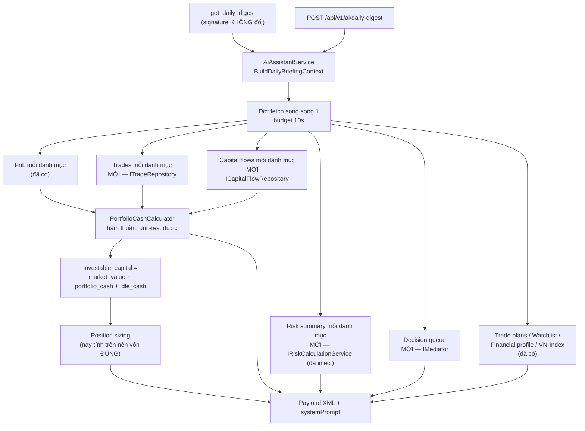

# Design — Bản tin hằng ngày: đủ context để agent phán đoán & quyết định

**Ngày:** 2026-07-26
**Trạng thái:** Chờ review
**Phạm vi:** `get_daily_digest` (MCP) + `POST /api/v1/ai/daily-digest` — cùng một code path

---

## 1. Vấn đề

### 1.1 Bug gốc: `idle_cash` luôn báo 0 dù danh mục đang giữ tiền

[`AiAssistantService.cs:1743`](../../../../src/InvestmentApp.Infrastructure/Services/AiAssistantService.cs#L1743) đọc tiền mặt **chỉ** từ hồ sơ tài chính cá nhân, không bao giờ đọc tiền trong tài khoản chứng khoán:

```csharp
var idleCash = profile.Accounts.Where(a => a.Type == FinancialAccountType.IdleCash).Sum(a => a.Balance);
investableCapital = totalValue + idleCash;
```

Sự cố thực tế 2026-07-26: user đã bán 14.500 cp HHV ngày 24/07 thu ~143,9tr. Bản tin báo `idle_cash = 0 VND`, agent kết luận *"không có tiền mặt, không còn dư địa xoay xở"* và khuyên *"muốn mua phải bán bớt trước"* — trong khi thực tế có ~288tr tiền mặt.

**Hệ quả nặng hơn con số hiển thị:** `investableCapital` chính là account balance đưa vào position sizing ([`:1790-1792`](../../../../src/InvestmentApp.Infrastructure/Services/AiAssistantService.cs#L1790-L1792)). Nền vốn thiếu ~288tr → **mọi khối lượng gợi ý trong `<pending_plans>` đều sai và thấp hơn thực tế**. Thêm nữa, cả block `<cash_and_net_worth>` bị bọc trong `if (profile != null)` nên user chưa có hồ sơ tài chính thì mất sạch thông tin tiền.

### 1.2 Bản tin mất 2 chiều thông tin

Bản tin gộp mọi thứ theo user rồi vứt mất:

- **Chiều "ở đâu"** — positions gộp chung mọi danh mục, không có tên danh mục. Agent không thể khuyên "bán ở danh mục nào".
- **Chiều "đã làm gì"** — `TotalRealizedPnL` **đã có sẵn** trong `PortfolioPnLSummary` mà bản tin đang fetch ([`PnLService.cs:50`](../../../../src/InvestmentApp.Infrastructure/Services/PnLService.cs#L50)) nhưng không in ra. Lệnh bán nửa HHV vô hình → agent tưởng vị thế còn nguyên.

### 1.3 Các nguồn dữ liệu đã có nhưng bản tin không dùng

| Thiếu trong bản tin | Nguồn đã tồn tại | Chặn quyết định gì |
|---|---|---|
| % tập trung mỗi mã | `IRiskCalculationService` → `PositionRiskItem.PositionSizePercent` | HHV chiếm 88% danh mục — agent phải tự tính |
| Khoảng cách tới SL, mã chưa có SL | `PositionRiskItem.DistanceToStopLossPercent`, `.StopLossPrice` | `<risk_alerts>` hiện chỉ là "lỗ > 5%" — thô, không theo rủi ro |
| Hàng đợi quyết định | `GetDecisionQueueQuery` | Đây **chính là** "hôm nay cần quyết gì" — vắng mặt hoàn toàn |
| Lệnh gần đây | `ITradeRepository.GetByPortfolioIdAsync` (phải gọi cho cash anyway) | Không thấy hành động vừa thực hiện |

---

## 2. Mục tiêu / Không làm

**Mục tiêu**
1. Bản tin không bao giờ khiến agent kết luận **sai** về tiền, vị thế, hay việc đã làm.
2. Position sizing tính trên nền vốn đúng.
3. Agent biết "hôm nay cần quyết gì" mà không phải gọi thêm tool.
4. Giữ nguyên budget latency hiện tại; block nào chậm thì vắng mặt, không làm hỏng bản tin.

**Không làm (out of scope)**
- Không đổi signature MCP tool → **không có rủi ro inputSchema regression**.
- Không hợp nhất công thức cash của `RiskCalculationService` / `SnapshotService` — xem §6.3.
- Không thêm performance/TWR/discipline score vào bản tin (agent tự gọi tool khi cần) — xem §5, `<drill_down>`.

---

## 3. Quyết định đã chốt với người dùng

| # | Câu hỏi | Chốt |
|---|---|---|
| 1 | Ngữ nghĩa cash | **Tách 2 dòng riêng**: `<portfolio_cash>` (tài khoản chứng khoán) và `<idle_cash>` (hồ sơ tài chính) |
| 2 | Hướng thiết kế | **C — lõi đủ-để-quyết + con trỏ đào sâu**, fan-out đầy đủ theo danh mục |
| 3 | Hình dạng payload (§5) | Duyệt, giữ nguyên |

**Nguyên tắc phân định nội dung:**
> Số nào mà thiếu nó agent sẽ **nói sai** → bắt buộc vào payload.
> Số nào chỉ làm câu trả lời **sâu hơn** → để agent tự gọi tool.

---

## 4. Kiến trúc & luồng dữ liệu

Chỉ sửa `BuildDailyBriefingContext` trong `AiAssistantService`. Không thêm project, không thêm tool.



### 4.1 Dependency cần thêm vào `AiAssistantService`

Đã có sẵn: `ITradeRepository`, `IRiskCalculationService`, `IPnLService`, `IPortfolioRepository`, `IFinancialProfileRepository`, `IPositionSizingService`.

| Thêm | Vị trí interface | Ghi chú |
|---|---|---|
| `ICapitalFlowRepository` | [`Application/RepositoryInterfaces.cs:63`](../../../../src/InvestmentApp.Application/RepositoryInterfaces.cs#L63), namespace `Application.Interfaces` | Trivial, cùng lớp với các repo đang inject |
| `IMediator` | MediatR (Application đã reference) | **Lần đầu Infrastructure dùng `IMediator`** — xem quyết định bên dưới |

**Quyết định về `IMediator`:** hiện không có source file nào trong Infrastructure dùng `IMediator`. Hai lựa chọn:

- **(a) Inject `IMediator` vào `AiAssistantService`** ⭐ chọn cách này. Một điểm hợp nhất duy nhất → MCP tool và HTTP endpoint **không thể nào lệch nhau**.
- (b) Để lớp Api (`DigestTools` / controller) fetch decision queue rồi truyền vào service. Sạch hơn về layering, nhưng **có 2 call site** nên phải nhớ cập nhật cả hai.

Chọn (a) vì failure mode vừa xảy ra hôm nay đúng là *hai bề mặt báo số khác nhau*. Chống lệch quan trọng hơn sự sạch sẽ về layering ở đây, và Infrastructure vốn đã compile-time depend vào Application nên không phá tầng — chỉ là lần dùng đầu tiên.

---

## 5. Đặc tả payload

Ký hiệu: **giữ** = không đổi · **sửa** = thay đổi · **MỚI** = thêm mới

```xml
<date>                       giữ
<market_context>             giữ  — VN-Index, độ rộng, khối ngoại

<portfolio_overview>         sửa
  <portfolios>N</portfolios>
  <total_market_value>       giữ (đổi tên từ total_value cho rõ nghĩa)
  <total_invested>           giữ
  <total_cash>               MỚI
  <total_capital>            MỚI  = total_market_value + total_cash
  <unrealized_pnl>           giữ
  <realized_pnl>             MỚI  — MIỄN PHÍ, đã có trong PnL đang fetch
  <return>                   giữ
  <portfolio name="24hmoney" market_value="..." cash="283,023,788"
             unrealized="..." realized="-35,922,000" />        MỚI

<cash_and_net_worth>         sửa — LUÔN in, không còn bọc trong if (profile != null)
  <portfolio_cash>           MỚI  — tiền trong tài khoản chứng khoán
  <idle_cash>                giữ  — chỉ in khi có hồ sơ tài chính
  <investable_capital>       sửa  = market_value + portfolio_cash + idle_cash
  <net_worth> <total_assets> <total_debt> <health_score>   giữ, chỉ khi có hồ sơ

<positions>                  sửa — thay <top_positions>
  | Mã | Danh mục | KL | Giá vốn | Giá | Giá trị | %DM | L/L % | L/L VND | SL | Cách SL % |

<recent_trades>              MỚI — 14 ngày gần nhất, lọc in-memory từ trades đã fetch
  | Ngày | Danh mục | Mã | Mua/Bán | KL | Giá | Giá trị |

<decision_queue>             MỚI — sort theo severity, kèm PortfolioName + Headline + ThesisOrReason

<risk_alerts>                sửa — theo khoảng cách SL + tập trung, không chỉ "lỗ > 5%"

<pending_plans>              giữ nội dung, sizing tính trên nền vốn ĐÚNG

<watchlist>                  giữ

<drill_down>                 MỚI — 1 dòng liệt kê tool để đào sâu
```

### 5.1 Ghi chú từng block mới

**`<portfolio_cash>` & `<total_cash>`** — công thức §6.

**`<realized_pnl>`** — `PortfolioPnLSummary.TotalRealizedPnL`, đã nằm trong dữ liệu đang fetch. **Chi phí thêm: 0 call.** Đây là thứ lẽ ra đã ngăn được sai sót hôm nay.

**`<positions>`** — nguồn: `PositionPnL` (Symbol, Quantity, AverageCost, CurrentPrice, MarketValue, UnrealizedPnL, UnrealizedPnLPercentage, RealizedPnL) + `PositionRiskItem` (PositionSizePercent, StopLossPrice, DistanceToStopLossPercent) join theo Symbol trong cùng danh mục. Cột `SL` để trống rõ ràng khi `StopLossPrice == null` — **"chưa đặt SL" là tín hiệu rủi ro, không phải dữ liệu thiếu**. Giới hạn 15 dòng, sort theo giá trị giảm dần; nếu bị cắt thì in rõ số dòng đã bỏ (không cắt im lặng).

**`<recent_trades>`** — lọc từ trades đã fetch cho cash, `TradeDate >= today - 14d`. Không thêm call. Cap 20 dòng, in rõ nếu cắt.

**`<decision_queue>`** — `GetDecisionQueueQuery`. Một mediator call, đã dedupe sẵn StopLoss + Scenario + Thesis-review và sort theo severity, `DecisionItemDto` đã có `PortfolioName`, `Headline`, `ThesisOrReason`, `CurrentPrice`, `PlannedExitPrice`. Block giá trị nhất, rẻ nhất.

**`<risk_alerts>`** — luật mới, sort theo mức nghiêm trọng:
1. `DistanceToStopLossPercent <= 0` → đã chạm/vượt SL
2. `0 < DistanceToStopLossPercent <= 3` → sát SL
3. `PositionSizePercent >= 30` → tập trung quá mức (nêu rõ % thực tế)
4. Vị thế mở **không có** `StopLossPrice`
5. Lỗ chưa thực hiện `<= -15%` (giữ lại luật cũ, nâng ngưỡng từ -5% để giảm nhiễu)

**`<drill_down>`** — một dòng tĩnh liệt kê tool cho câu hỏi sâu hơn: `get_performance` (TWR/CAGR/Sharpe/max drawdown), `get_equity_curve`, `get_monthly_returns`, `get_technical_analysis`, `get_stock_price_history`, `get_discipline_score`, `get_symbol_timeline`. Mục đích: agent biết **thứ gì có thể tra thêm**, tránh trả lời chắc chắn từ dữ liệu không có trong payload.

---

## 6. Tính tiền mặt danh mục

### 6.1 Công thức

```
portfolio_cash = InitialCapital
               + GetTotalFlowByPortfolioIdAsync(portfolioId)
               - grossBuys
               + grossSells

grossBuys  = Σ (Quantity × Price + Fee + Tax)  với TradeType == BUY
grossSells = Σ (Quantity × Price − Fee − Tax)  với TradeType == SELL
```

Lấy nguyên từ [`CashFlowAdjustedReturnService.cs:432`](../../../../src/InvestmentApp.Infrastructure/Services/CashFlowAdjustedReturnService.cs#L432) — công thức đã được dùng và khớp với hero card capital-flows trên UI.

### 6.2 Đã verify: không có bug đếm 2 lần vốn ban đầu

Nghi vấn: `InitialCapital + totalFlows` có thể cộng đôi seed deposit (tạo tự động ở [`CreatePortfolioCommandHandler.cs:32-38`](../../../../src/InvestmentApp.Application/Portfolios/Commands/CreatePortfolio/CreatePortfolioCommandHandler.cs#L32-L38)).

**Kết luận: không.** [`CapitalFlowRepository.cs:63`](../../../../src/InvestmentApp.Infrastructure/Repositories/CapitalFlowRepository.cs#L63) đã lọc `!f.IsSeedDeposit`. An toàn dùng trực tiếp.

### 6.3 Codebase đang có 2 công thức cash khác nhau — có thật, cần ADR

| Nơi | Công thức | Tính lãi/lỗ đã thực hiện? |
|---|---|---|
| [`CashFlowAdjustedReturnService.cs:432`](../../../../src/InvestmentApp.Infrastructure/Services/CashFlowAdjustedReturnService.cs#L432) | `Initial + flows − grossBuys + grossSells` | ✅ có |
| [`RiskCalculationService.cs:91`](../../../../src/InvestmentApp.Infrastructure/Services/RiskCalculationService.cs#L91) | `Initial + flows − TotalInvested` | ❌ không |
| [`SnapshotService.cs:53`](../../../../src/InvestmentApp.Infrastructure/Services/SnapshotService.cs#L53) | `Initial + flows − TotalInvested` | ❌ không |

Hai công thức cho ra **số khác nhau ngay khi có vị thế đã chốt** — đúng tình huống HHV. `TotalInvested` chỉ phản ánh vị thế đang mở, nên bỏ mất lãi/lỗ đã thực hiện.

**Quyết định:** bản tin dùng công thức có realized (chính xác về tiền thật). **Không** sửa `RiskCalculationService` / `SnapshotService` trong PR này — chúng ảnh hưởng số liệu risk hiển thị và snapshot lịch sử, cần test riêng và có thể làm lệch dữ liệu đã lưu. Viết ADR ghi nhận phân kỳ + kế hoạch hợp nhất sau.

> ⚠️ **Chấp nhận có ý thức:** trong thời gian chưa hợp nhất, `portfolio_cash` trong bản tin có thể lệch so với cash mà API risk trả về, đối với danh mục đã có vị thế chốt. ADR phải nói rõ điều này để người đọc sau không tưởng là bug mới.

### 6.4 Trích helper

Hàm thuần, không I/O — dễ unit test:

```csharp
public static class PortfolioCashCalculator
{
    public static decimal Compute(decimal initialCapital, decimal netFlowExcludingSeed, IEnumerable<Trade> trades);
}
```

Đặt trong `InvestmentApp.Application` (cạnh các interface repo) để cả Infrastructure lẫn test đều dùng được.

---

## 7. Sửa position sizing

`ShouldComputeSizing(entryPrice, stopLoss, investableCapital)` và `BuildPlanSizingRequest(plan, investableCapital)` giữ nguyên signature — **chỉ giá trị `investableCapital` truyền vào là đúng lên**. Không đổi logic sizing.

Fallback khi chưa có hồ sơ tài chính: `investableCapital = total_market_value + total_cash` (trước đây chỉ `totalValue`).

---

## 8. Suy giảm mềm khi timeout

Giữ đúng pattern hiện có: `ContinueWith` + `IsCompletedSuccessfully` + `Task.WhenAll(...).WaitAsync(10s)`, mỗi block bọc `try/catch` riêng.

| Block hỏng | Hành vi |
|---|---|
| Trades / capital flows của 1 danh mục | Bỏ `cash` của **riêng** danh mục đó, ghi rõ `cash="n/a"` — **không** in 0 |
| Risk summary | `<positions>` vẫn in nhưng vắng cột %DM / SL; `<risk_alerts>` lùi về luật lỗ nặng |
| Decision queue | Bỏ block, các block khác giữ nguyên |
| Financial profile | Bỏ `idle_cash` + net-worth; `portfolio_cash` **vẫn in** |

**Luật cứng: không bao giờ in `0` cho một giá trị chưa fetch được.** Đây chính là hình thái sai của sự cố hôm nay — một con số thiếu bị trình bày như một sự thật. Dùng `n/a` và nói rõ trong `systemPrompt` rằng `n/a` nghĩa là chưa lấy được, không phải bằng 0.

---

## 9. Kế hoạch test (TDD — viết test trước)

Tests trong `tests/InvestmentApp.Infrastructure.Tests/Services/AiAssistantServiceDailyDigestTests.cs` (file đã tồn tại) và một file mới cho calculator.

**`PortfolioCashCalculator` (Application.Tests) — hàm thuần:**
1. Không lệnh, không flow → cash = InitialCapital
2. Chỉ mua → cash giảm đúng giá trị mua **kèm fee + tax**
3. Mua rồi bán một phần → cash tăng theo tiền bán **trừ** fee + tax *(tái hiện đúng kịch bản HHV)*
4. Có nạp/rút thêm → cộng đúng netFlow
5. Bán hết toàn bộ → cash = Initial + netFlow + tổng lãi/lỗ đã thực hiện

**Digest (Infrastructure.Tests):**
6. **Test hồi quy cho bug gốc:** danh mục có lệnh bán → payload chứa `<portfolio_cash>` khác 0 *(test này phải FAIL trên code hiện tại)*
7. Không có hồ sơ tài chính → vẫn có `<portfolio_cash>` và `<investable_capital>`; không có `<idle_cash>`
8. Có hồ sơ tài chính → `investable_capital == market_value + portfolio_cash + idle_cash`
9. `<realized_pnl>` xuất hiện và khớp `TotalRealizedPnL`
10. Nhiều danh mục → mỗi danh mục một dòng `<portfolio ... />` với cash riêng
11. Vị thế không có `StopLossPrice` → xuất hiện trong `<risk_alerts>` nhóm "chưa đặt SL"
12. Vị thế `PositionSizePercent >= 30` → xuất hiện nhóm "tập trung quá mức"
13. Trades repo throw → `cash="n/a"`, **không phải** `0`, và các block khác vẫn in
14. Decision queue throw → bản tin vẫn hợp lệ, chỉ vắng block đó
15. `<recent_trades>` chỉ chứa lệnh trong 14 ngày
16. Sizing trong `<pending_plans>` tính trên `investableCapital` đã gồm cash *(khẳng định rõ hồi quy của bug)*

**Guard test (Api.Tests):** `McpToolDiscoveryTests` — khẳng định `get_daily_digest` **inputSchema không đổi**, chặn rò rỉ tham số DI vào schema.

---

## 10. Giả định cần bạn xác nhận ở cửa review

1. **Ngưỡng `<risk_alerts>`** — SL ≤ 3%, tập trung ≥ 30%, lỗ ≤ -15%. Số do tôi chọn, chưa hỏi bạn.
2. **Cửa sổ `<recent_trades>` = 14 ngày**, cap 20 dòng.
3. **`<positions>` cap 15 dòng, 11 cột.** Rậm nhưng agent đọc bảng tốt; nếu muốn gọn tôi bỏ `L/L VND` và `Giá vốn`.
4. **Inject `IMediator` vào Infrastructure** (§4.1) — lần đầu trong codebase.
5. **Không hợp nhất công thức cash ở risk/snapshot** trong PR này, chỉ ghi ADR (§6.3).

## 11. Tài liệu phải cập nhật trước khi commit

Theo `CLAUDE.md`:
- `docs/architecture.md` — dependency mới của `AiAssistantService`
- `docs/business-domain.md` — ngữ nghĩa `portfolio_cash` vs `idle_cash`
- `docs/adr/` — ADR về phân kỳ công thức cash (§6.3)
- `frontend/src/assets/CHANGELOG.md` — sửa lỗi bản tin báo sai tiền mặt
