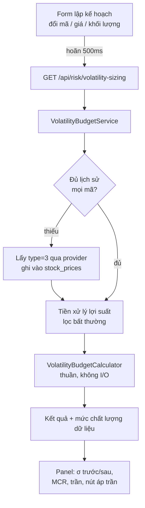

# Trần khối lượng theo ngân sách biến động — áp Lý thuyết danh mục hiện đại vào form lập kế hoạch

Ngày: 2026-08-11 · Trạng thái: thiết kế, chờ duyệt

## 0. Thuật ngữ

| Viết tắt | Tên đầy đủ | Nghĩa trong tài liệu này |
|---|---|---|
| MPT | Modern Portfolio Theory (Lý thuyết danh mục hiện đại) | Khung Markowitz 1952: rủi ro danh mục phụ thuộc hiệp phương sai giữa các tài sản, không phải tổng rủi ro từng tài sản |
| σ (sigma) | Standard deviation (độ lệch chuẩn) | Thước đo biến động. Luôn quy về **%/năm** trong tài liệu này |
| Σ (sigma hoa) | Covariance matrix (ma trận hiệp phương sai) | Bảng đo từng cặp mã dao động cùng nhau đến đâu |
| ρ (rho) | Correlation coefficient (hệ số tương quan) | Hiệp phương sai chuẩn hóa về [−1, 1] |
| MCR | Marginal Contribution to Risk (đóng góp rủi ro biên) | Phần trăm rủi ro danh mục mà một vị thế gánh — khác với phần trăm vốn nó chiếm |
| GMV | Global Minimum Variance (phương sai tối thiểu toàn cục) | Cách chia tỷ trọng cho σ nhỏ nhất; là mũi trái của đường biên hiệu quả |
| VaR | Value at Risk (giá trị chịu rủi ro) | Ngưỡng lỗ ở một mức tin cậy; app đang dùng 95% |
| GDKHQ | Giao dịch không hưởng quyền | Ngày giá tham chiếu bị điều chỉnh do chia cổ tức / thưởng / tách |

## 1. Vấn đề

Form lập kế hoạch (`TradePlan`) hiện hỏi người dùng khối lượng mua, và kiểm tra được ba thứ: tỷ trọng vị thế, tỷ trọng ngành, và tỷ lệ lãi/lỗ. Cả ba đều là ràng buộc **tính trên từng mã riêng lẻ**.

Không có ràng buộc nào nhìn vào **quan hệ giữa mã mới và những mã đang giữ**. Mua thêm một mã tương quan 0,6 với vị thế lớn nhất và mua một mã tương quan 0,0 là hai hành động rủi ro rất khác nhau, nhưng hôm nay app coi chúng như nhau miễn tỷ trọng vốn bằng nhau.

Đó chính là khoảng trống mà MPT lấp: rủi ro danh mục không phải tổng rủi ro từng phần.

### 1.1 Số đo thực tế (đo ngày 2026-08-11)

Rổ 7 mã vốn hóa lớn (FPT, HPG, VCB, VNM, MWG, TCB, SSI), 64 phiên gần nhất, chia đều:

| Đại lượng | Giá trị |
|---|---|
| σ trung bình từng mã | 28,7%/năm |
| σ danh mục chia đều | **19,4%/năm** |
| Lợi ích đa dạng hóa | 32% |
| Tương quan trung bình từng cặp | 0,34 |
| Cặp tương quan cao nhất | MWG–SSI 0,63 |
| Cặp tương quan thấp nhất | FPT–VNM 0,01 |

Kết luận: đa dạng hóa ở thị trường Việt Nam có tác dụng thật và đo được. Giả định phổ biến rằng blue-chip Việt Nam tương quan 0,7–0,8 là **sai** với dữ liệu hiện tại.

## 2. Quyết định

Xây một panel trong form lập kế hoạch, trả về **một con số hành động được**: khối lượng tối đa của mã này mà danh mục vẫn nằm trong ngân sách biến động.

Bốn quyết định chốt:

| # | Quyết định | Lý do |
|---|---|---|
| Đ1 | Điểm chạm là **form lập kế hoạch**, không phải màn hình phân tích riêng | Con số phải xuất hiện đúng lúc đang quyết định, không phải lúc ngắm nghía |
| Đ2 | **Không dùng lợi nhuận kỳ vọng** ở bất kỳ đâu trong V1 | Xem §2.1 |
| Đ3 | Ngân sách biến động **suy từ `MaxDrawdownAlertPercent`** đã có, không thêm trường mới | Không đẻ ra con số người dùng sẽ không bao giờ chỉnh |
| Đ4 | Vượt trần thì **cảnh báo + nút áp trần**, không chặn lưu | Xem §2.2 |

### 2.1 Vì sao V1 không có đường cong frontier

Đường biên hiệu quả cần trục tung là lợi nhuận kỳ vọng. Ước lượng lợi nhuận kỳ vọng từ trung bình lịch sử là điểm yếu chí mạng của MPT — với 64 phiên, sai số chuẩn của trung bình lớn hơn chênh lệch giữa các mã, nên bộ tối ưu sẽ dồn vốn vào mã tình cờ tăng mạnh gần đây. Đây là hiện tượng "error maximization" đã biết từ lâu.

Vấn đề nằm sâu hơn ở **phép nghịch đảo**: mọi bộ tối ưu Markowitz đều cần Σ⁻¹, và nghịch đảo khuếch đại sai số ước lượng. Với 64 quan sát và 10 mã, Σ đủ ổn định để **nhân**, nhưng quá mỏng để **nghịch đảo** an toàn.

Thiết kế này chỉ dùng phép nhân:

```
σ_danh mục = √(wᵀ Σ w)
```

Không có Σ⁻¹ ở bất kỳ đâu trong V1. Đó là ranh giới giữa phần MPT đo được và phần MPT tự lừa mình.

### 2.2 Vì sao cảnh báo chứ không phải cổng cứng

Dự án có sẵn cổng kỷ luật cứng (`TradePlanDisciplineGate`) và chúng đúng, vì chúng dựa trên dữ liệu người dùng tự khai (đã điền luận điểm chưa, tỷ lệ lãi/lỗ bao nhiêu) — không có sai số ước lượng.

Trần khối lượng thì khác: nó dựa trên Σ ước lượng từ 64 phiên. Một cổng cứng dựng trên con số không chắc chắn sẽ bị lách, và khi người dùng học được cách lách một cổng, **các cổng thật khác cũng mất thiêng theo**. Cảnh báo kèm nút áp trần giữ được thông tin mà không tiêu hao uy tín của hệ thống cổng.

## 3. Phát hiện về dữ liệu (đo thực tế, không phải giả định)

Ba phát hiện dưới đây thay đổi thiết kế và phải xử lý trước khi tính toán có nghĩa.

### 3.1 Endpoint graph không trả dữ liệu ngày như code đang giả định

`HmoneyMarketDataProvider.GetHistoricalPricesAsync` ánh xạ số ngày yêu cầu sang tham số `type`. Độ chi tiết thật của từng `type` (đo trên mã FPT):

| type | Số điểm | Khoảng phủ | Giãn cách | Nhãn trong code |
|---|---|---|---|---|
| 7 | 22 | 29 ngày | ~1,4 ngày (theo phiên) | — |
| 3 | 65 | 90 ngày | ~1,4 ngày (theo phiên) | "1 month" |
| 4 | 61 | 180 ngày | 3,0 ngày | "3 months" |
| 5 | 50 | 358 ngày | 7,3 ngày | "1 year" |
| 6 | 61 | 1800 ngày | 30,0 ngày | "5 years" |

Hệ quả: **`type=3` mới là nguồn dữ liệu ngày, và nó phủ 90 ngày chứ không phải 1 tháng.** Nhãn trong code sai một bậc.

Nghiêm trọng hơn, ánh xạ hiện tại là `days <= 100 => type 4`. Nghĩa là hôm nay **yêu cầu 90 ngày lịch sử sẽ nhận về thanh 3 ngày, không phải thanh ngày** — rồi bị bộ lọc `from`/`to` cắt còn khoảng 30 điểm. Ba mươi quan sát 3 ngày là quá mỏng để ước lượng hiệp phương sai.

Quyết định: tính năng này gọi thẳng `type=3` qua một đường riêng, không đi qua ánh xạ theo số ngày. Không sửa ánh xạ cũ trong phạm vi này — nó phục vụ biểu đồ hiển thị và đổi sẽ ảnh hưởng chỗ khác; ghi nhận là nợ kỹ thuật riêng.

Trần cứng: **65 quan sát ngày** là tối đa lấy được. Mọi thiết kế phải sống được với con số đó.

### 3.2 Giá không được điều chỉnh theo sự kiện quyền

Đo trên VHM, 64 phiên:

| Ngày | Giá trước | Giá sau | Biến động |
|---|---|---|---|
| 2026-08-06 | 153,0 | 77,1 | **−49,6%** |

Đây gần như chắc chắn là ngày GDKHQ chia tách, không phải mất một nửa vốn hóa trong một phiên. 24hmoney trả giá thô, chưa điều chỉnh.

Hậu quả nếu bỏ qua — và đây là kiểu hỏng **âm thầm**, mọi con số vẫn hiện ra bình thường:

| Đại lượng của VHM | Chưa xử lý | Sau khi lọc |
|---|---|---|
| σ năm | **109,0%** | **48,9%** |
| ρ với FPT | +0,01 | +0,10 |
| ρ với HPG | +0,01 | −0,04 |
| ρ với VNM | −0,14 | −0,21 |

Méo mó nằm gần như toàn bộ ở **σ, bị thổi 2,2 lần** bởi đúng một quan sát. Tương quan gần như không đổi — VHM vốn dĩ tương quan thấp với rổ này, đó không phải ảo ảnh do cú nhảy tạo ra.

Hướng sai lệch: σ bị thổi làm trần khối lượng của mã đó **chặt hơn thực tế**, và làm σ danh mục toàn phần cao giả. Không phải hướng nguy hiểm nhất, nhưng nó bóp méo im lặng và không có gì trên màn hình báo hiệu.

Đáng chú ý: 48,9% vẫn là biến động cao thật — cao nhất rổ. Bộ lọc sửa được sự kiện quyền, **không** biến một mã biến động mạnh thành mã hiền lành.

Dự án đã có `CorporateActionAdjuster` nhưng nó chạy trên sự kiện quyền **người dùng tự nhập cho danh mục của mình** — không phủ được mã ứng viên chưa từng mua.

Quyết định: thêm **bộ lọc lợi suất bất thường** trong bước tiền xử lý (§4.3). Không cố dựng lại giá đúng — chỉ loại quan sát và nói rõ đã loại.

### 3.3 Không có lịch sử VNINDEX từ endpoint graph

`symbol=VNINDEX` và `symbol=VN30` đều trả 0 điểm. (`symbol=VNI` có trả dữ liệu nhưng giá trị 6–7 điểm — đó là một mã penny, không phải chỉ số.)

Hệ quả: mọi phương án neo ngân sách vào biến động VNINDEX đều không khả thi ở V1 qua đường này. Lịch sử chỉ số chỉ có trong `IMarketIndexRepository` cục bộ, độ sâu bằng thời gian `PriceSnapshotJobService` đã chạy. Đây là một lý do nữa để chọn Đ3.

### 3.4 Mã chưa từng mua không có lịch sử cục bộ

`PriceSnapshotJobService` chỉ lưu giá cho mã **đã có giao dịch**. Mã ứng viên mới — đúng cái mã panel cần tính — có 0 dòng trong `stock_prices`.

Quyết định: lấy theo yêu cầu qua provider (`type=3`), ghi vào `stock_prices` để lần sau khỏi gọi lại. Xem §4.2.

## 4. Thiết kế

### 4.1 Luồng



### 4.2 Nguồn dữ liệu và bộ nhớ đệm

Thứ tự đọc cho từng mã:

1. `stock_prices` cục bộ, 90 ngày gần nhất, sắp theo ngày.
2. Nếu < 40 quan sát: gọi provider `type=3`, ghi bổ sung vào `stock_prices`, đọc lại.
3. Nếu vẫn < 40 quan sát: mã đó vào danh sách `MissingSymbols`, **không được thay bằng số 0**.

Ngưỡng 40 là sàn để hiệp phương sai có nghĩa (trên trần 65 đo được ở §3.1). Dưới ngưỡng, kết quả trả `null` chứ không trả giá trị kém tin.

Đệm **chuỗi lợi suất từng mã**, TTL 15 phút — form gọi lại mỗi nhịp hoãn 500ms, không được biến mỗi phím gõ thành một chùm truy vấn.

> **Đo lại sau khi ship (2026-08-12):** đệm ở mức từng mã **không** làm lần gọi sau nhanh hơn — FPT lần 1 962ms, lần 2 1534ms, VHM 8593ms. Mỗi request vẫn đọc lại trades + sự kiện quyền + dựng vị thế từ Mongo, và chi phí bị chi phối bởi các vòng gọi đó chứ không phải giá. Muốn đạt ý định ban đầu thì phải đệm ở mức **kết quả cả request theo danh mục**, chưa làm.

### 4.3 Tiền xử lý lợi suất

Với mỗi mã, từ chuỗi giá đóng cửa dựng chuỗi lợi suất ngày, rồi:

- Loại quan sát có |lợi suất| > 15%. Biên độ HOSE là ±7%/phiên, HNX ±10%, UPCoM ±15%. Vượt 15% trong một phiên không phải biến động thị trường — đó là sự kiện quyền hoặc lỗi dữ liệu.
- Đếm số quan sát bị loại cho từng mã, đưa vào kết quả.
- Nếu một mã bị loại > 3 quan sát: hạ mức chất lượng xuống `Partial` và nêu tên mã.

Ngưỡng 15% cố ý nới hơn biên độ sàn cao nhất để không cắt nhầm chuỗi trần/sàn liên tiếp hợp lệ.

Với rổ 8 mã (7 mã ở §1.1 cộng VHM), quét toàn bộ 64 phiên, luật này loại **đúng một quan sát**: VHM ngày 2026-08-06. Không mã nào khác có phiên vượt ngưỡng — nghĩa là bộ lọc bắt đúng thứ cần bắt mà không cắt nhầm biến động thật.

### 4.4 Quy đổi ngưỡng sụt giảm sang ngân sách biến động

Diễn giải `MaxDrawdownAlertPercent` là **ngưỡng lỗ ở mức tin cậy 95% trong một tháng giao dịch (21 phiên)**:

```
σ_ngân sách (năm) = MaxDrawdownAlertPercent / (1,645 × √(21/252))
```

Hệ số 1,645 là phân vị 95% một phía của phân phối chuẩn — **cùng hằng số** đã dùng trong `CalculateValueAtRiskAsync` hiện tại, nên hai chỗ nhất quán.

Vì sao chọn chân trời 1 tháng chứ không phải 1 năm — đây là điểm quyết định sự sống còn của tính năng:

| Chân trời | σ ngân sách suy ra (từ 10%) | So với danh mục thật 19,4% |
|---|---|---|
| 1 tuần | 43,2%/năm | quá rộng, không bao giờ chạm |
| **1 tháng** | **21,1%/năm** | **sát — trần thỉnh thoảng chạm, đúng trạng thái hữu ích** |
| 3 tháng | 12,2%/năm | luôn vượt → trần luôn bằng 0 |
| 6 tháng | 8,6%/năm | luôn vượt |
| 1 năm | 6,1%/năm | luôn vượt |

Nếu diễn giải theo năm, giá trị mặc định 10% cho ra ngân sách 6,1%/năm trong khi danh mục thật là 19,4% — trần sẽ **luôn** bằng 0 và panel thành tiếng ồn vĩnh viễn ngay từ ngày đầu.

Ràng buộc bắt buộc: **σ ngân sách phải hiện trên panel kèm cách suy ra nó**, không bao giờ là hằng số ẩn. Người dùng phải thấy được "ngưỡng sụt giảm 10% của bạn ⇒ ngân sách 21,1%/năm" để tự phán đoán.

Ca danh mục đã vượt ngân sách trước khi thêm lệnh: trần = 0, và panel nói thẳng danh mục đang vượt, kèm σ hiện tại so với ngân sách. Không hiện nút áp trần trong ca này — áp trần 0 không phải hành động có nghĩa.

### 4.5 Giải trần khối lượng

Gọi V = giá trị danh mục hiện tại, σ_p = σ danh mục hiện tại, P = giá vào lệnh, σ_x = σ mã mới, ρ = tương quan giữa mã mới và danh mục hiện tại, và a = q·P là số tiền định giải ngân.

Phương sai sau khi thêm, tính trên **giá trị tuyệt đối** để tránh vòng lặp chuẩn hóa tỷ trọng:

```
S²(a) = (V·σ_p)² + 2ρ(V·σ_p)(a·σ_x) + (a·σ_x)²
```

Ràng buộc: S(a) ≤ (V + a)·σ_ngân sách.

Bình phương hai vế và gom theo a cho một phương trình bậc hai `Aa² + Ba + C ≤ 0` với:

```
A = σ_x² − σ_ngân sách²
B = 2ρ·V·σ_p·σ_x − 2V·σ_ngân sách²
C = V²(σ_p² − σ_ngân sách²)
```

Nghiệm đóng, không cần bộ tối ưu, không cần thư viện ngoài. Trần khối lượng = ⌊a*/P⌋ với a* là nghiệm dương lớn nhất thỏa ràng buộc.

**Toàn bộ phép giải phải chạy bằng `double`, không phải `decimal`** — kể cả khi dựng A, B, C. Cả ba hệ số tỷ lệ với luỹ thừa của giá trị danh mục (C với V², B với V), nên chính việc *dựng* chúng đã vượt `decimal.MaxValue` (7,9×10²⁸): C = V²·(σ_p²−σ_b²) tràn từ V ≈ 3×10¹². Ném ở bất kỳ đâu trong đây nghĩa là panel "cảnh báo, không bao giờ chặn" trả về 500. Phép ép cuối `(decimal)root` cũng phải chặn ngưỡng: A dương nhưng cực nhỏ (σ_mã sát σ_ngân sách) cho nghiệm hữu hạn trong `double` mà vượt `decimal.MaxValue`.

Các ca biên phải xử lý tường minh, mỗi ca một test:

| Ca | Điều kiện | Kết quả |
|---|---|---|
| Danh mục rỗng | V = 0 | Trần theo σ_x đơn lẻ: a ≤ ∞ nếu σ_x ≤ σ_ngân sách, ngược lại trần 0 |
| Đã vượt ngân sách | σ_p > σ_ngân sách | C > 0, trần = 0, panel báo đang vượt |
| Mã ít biến động hơn ngân sách | A < 0 | Parabol mở xuống — mua bao nhiêu cũng không vượt; trần = `null`, panel ghi "không bị ràng buộc bởi biến động" (giới hạn tỷ trọng vị thế vẫn áp dụng riêng) |
| A = 0 (σ_x = σ_ngân sách) | phương trình tuyến tính | Giải bậc nhất, không chia cho 0 |
| Thiếu lịch sử mã mới | quan sát < 40 | Toàn bộ kết quả `null`, `DataQuality = Insufficient` |

### 4.6 Đóng góp rủi ro biên

```
MCR_i = w_i · (Σw)_i / σ²_p
```

Hiển thị cạnh tỷ trọng vốn để lộ ra chênh lệch: "FPT chiếm 14% vốn nhưng gánh 22% rủi ro." Đây là con số dạy được nhiều nhất trên panel và nó **miễn phí** — đã có Σ và w rồi.

### 4.7 Ranh giới mã nguồn

Đặt trong `Application/Common/` theo đúng tiền lệ `TradePlanPriceAdjuster` và `CorporateActionAdjuster`:

`VolatilityBudgetCalculator` — tĩnh, thuần, không I/O, không phụ thuộc kho dữ liệu:
- `AnnualizedVolatility(returns)` → σ × √252
- `CovarianceMatrix(returnsBySymbol)`
- `PortfolioVolatility(values, covariance)`
- `MarginalRiskContribution(values, covariance)`
- `SolveMaxAllocation(V, sigmaP, sigmaX, rho, sigmaBudget)` → `decimal?`
- `DrawdownToVolatilityBudget(maxDrawdownPercent)`
- `FilterAbnormalReturns(returns)` → `(kept, removedCount)`

Toàn bộ toán học kiểm thử được bằng mảng số, không cần Moq.

`IVolatilityBudgetService` (Application/Common/Interfaces) + `VolatilityBudgetService` (Infrastructure/Services) lo lấy dữ liệu, đệm, và bổ khuyết.

**Không** thêm vào `IRiskCalculationService`. Cài đặt của nó đã 929 dòng và đang ôm chín trách nhiệm; thêm nữa là làm nặng thêm một tệp vốn đã quá tải.

### 4.8 Hợp đồng trả về

```csharp
public class VolatilitySizingResult
{
    public string Symbol { get; set; }
    public decimal? CurrentVolatilityPercent { get; set; }
    public decimal? ProjectedVolatilityPercent { get; set; }
    public decimal BudgetVolatilityPercent { get; set; }
    public decimal SourceMaxDrawdownPercent { get; set; }
    public decimal? CorrelationWithPortfolio { get; set; }
    public decimal? MarginalRiskContributionPercent { get; set; }
    public decimal? CapitalWeightPercent { get; set; }
    public int? MaxQuantityWithinBudget { get; set; }
    public bool IsUnconstrainedByVolatility { get; set; }
    public bool PortfolioAlreadyOverBudget { get; set; }
    public VolatilityDataQuality DataQuality { get; set; }
    public List<string> MissingSymbols { get; set; } = new();
    public List<string> AdjustedSymbols { get; set; } = new();
    public List<string> FetchFailedSymbols { get; set; } = new();
    public int ObservationCount { get; set; }
}

public enum VolatilityDataQuality { Full, Partial, Insufficient }
```

`FetchFailedSymbols` tách khỏi `MissingSymbols`: nguồn giá hỏng và mã thật sự chưa có lịch sử đều cho `Insufficient`, nhưng nói nhầm ca đầu thành ca sau là phát biểu **sai sự thật** về mã đó — "chưa đủ lịch sử giá cho FPT" trong khi FPT có thừa, và người dùng kết luận mã này mới hoặc thanh khoản kém. Kéo theo: `IMarketDataProvider.GetDailyHistoryAsync` **không** được nuốt ngoại lệ, khác 8 hàm còn lại cùng file.

Mọi trường phần trăm đều nullable **theo chủ ý**. Trả 0 cho một đại lượng chưa tính được là lẫn "bằng không" với "chưa biết" — cùng nguyên tắc đã áp cho `SectorExposureForPlan`. `IsUnconstrainedByVolatility` tách bạch với `MaxQuantityWithinBudget = null`: một cái nghĩa là không có ràng buộc, cái kia nghĩa là không tính được.

### 4.9 Bề mặt agent (MCP)

Hai thứ, và chỉ có cái thứ hai mới là cơ chế:

- `get_volatility_sizing` — tool read-only, cùng dữ liệu với panel.
- `create_trade_plan` **tự gọi** truy vấn trần cho lệnh Mua có gắn danh mục, rồi nối cảnh báo vào chuỗi trả về.

Cái thứ hai là bắt buộc vì không có nó thì lan can chỉ tồn tại trên đường người dùng tự bấm form: `get_volatility_sizing` là tool riêng, và lời dặn "gọi trước khi create_trade_plan" lại nằm trên chính cái tool agent phải đã quyết định gọi rồi mới đọc được. **Lời dặn không phải cơ chế.**

Vẫn không chặn (Đ4): kế hoạch tạo bình thường, id giữ nguyên ở đầu chuỗi. Im lặng ở ba ca — trong trần, không bị ràng buộc, không gắn danh mục — vì nối một dòng vào *mọi* lời gọi biến cảnh báo thành tiếng ồn. Ca **không tính được** thì phải nói, vì im ở đó đọc thành "đã kiểm và ổn". Truy vấn hỏng thì nuốt ngoại lệ: kế hoạch đã tạo xong, ném ra khiến agent tưởng thất bại rồi tạo lại, sinh kế hoạch trùng.

### 4.10 Giao diện

Panel nằm dưới ô khối lượng trong form lập kế hoạch, tái dùng đúng khuôn hoãn 500ms của panel tỷ trọng ngành.

Năm trạng thái, mỗi trạng thái là một ca kiểm thử:

| Trạng thái | Hiển thị |
|---|---|
| `Full`, trong trần | σ trước → sau, ngân sách, MCR vs tỷ trọng vốn, trần, viền xám |
| `Full`, vượt trần | như trên, viền đỏ, nút **Dùng {trần}** điền thẳng vào ô khối lượng |
| `Partial` | như trên kèm dòng nêu tên mã bị chỉnh và số quan sát bị loại |
| `Insufficient`, thiếu lịch sử thật | một dòng nêu mã thiếu. **Không hiện con số nào.** |
| `Insufficient`, nguồn giá lỗi | dòng màu hổ phách "Chưa **lấy** được lịch sử giá cho …". Câu khác hẳn dòng trên |

Trạng thái `Insufficient` không được im lặng biến mất — panel rỗng đọc thành "không có vấn đề gì", tức là kết luận ngược với sự thật.

Nút **Dùng {trần}** đặt bên phải theo quy ước nút chính của dự án.

## 5. Không làm (YAGNI)

| Bỏ | Lý do |
|---|---|
| Đường cong đường biên hiệu quả | Cần lợi nhuận kỳ vọng — xem §2.1. Ghi làm V2, §7 |
| Điểm phương sai tối thiểu toàn cục (GMV) | Cần Σ⁻¹ nhưng chỉ trả một con số tham khảo không gắn hành động nào |
| Tự động đề xuất tái cân bằng toàn danh mục | Đầu ra là danh sách lệnh mua/bán — quá xa một quyết định đơn lẻ, và chi phí giao dịch chưa được mô hình hóa |
| Co giãn Ledoit–Wolf cho Σ | Chỉ có ích khi nghịch đảo Σ. V1 không nghịch đảo |
| Trường ngân sách biến động riêng trong hồ sơ rủi ro | Đ3 |
| Sửa ánh xạ `type` trong provider | §3.1 — ảnh hưởng biểu đồ hiển thị, tách thành việc riêng |
| Dựng lại giá đã điều chỉnh sự kiện quyền | §3.2 — lọc và khai báo là đủ cho V1 |

## 6. Kiểm thử

### 6.1 `VolatilityBudgetCalculator` (Application.Tests) — thuần, không mock

| Nhóm | Ca |
|---|---|
| σ | Chuỗi hằng → 0. Chuỗi đã biết → khớp giá trị tính tay. Nhân √252 đúng |
| Σ | Hai chuỗi giống hệt → ρ = 1. Ngược pha → ρ = −1. Độc lập → ρ ≈ 0 |
| σ danh mục | Hai mã ρ = 1 → σ_p = trung bình có trọng số. ρ = 0 → nhỏ hơn trung bình có trọng số (chứng minh lợi ích đa dạng hóa) |
| Giải trần | Nghiệm đóng khớp kiểm tra ngược: nạp trần vào công thức σ ra đúng σ ngân sách trong sai số 0,01% |
| Biên | Cả năm ca ở bảng §4.5, mỗi ca một test |
| Quy đổi | 10% → 21,1%/năm trong sai số 0,1. Ghim **nguyên văn** hệ số, không dùng khoảng |
| Lọc bất thường | −49,6% bị loại. −7,2% được giữ. Đếm số bị loại đúng |
| Chia cho 0 | V = 0, σ_p = 0, σ_x = 0, ngân sách = 0 — không ca nào ném lỗi |

### 6.2 `VolatilityBudgetService` (Infrastructure.Tests) — Moq kho dữ liệu

| Ca | Kỳ vọng |
|---|---|
| Đủ dữ liệu cục bộ | Không gọi provider |
| Cục bộ 20 quan sát | Gọi provider, ghi vào kho, tính lại |
| Provider trả rỗng | `DataQuality = Insufficient`, `MissingSymbols` có mã đó, **không ném lỗi** |
| Một trong năm mã thiếu | `Partial`, bốn mã kia vẫn tính |
| Gọi hai lần trong TTL | Provider được gọi đúng một lần |
| Mã có nhảy giá | Nằm trong `AdjustedSymbols`, σ ở mức hợp lý chứ không phải ba chữ số |

Ca cuối là ca chống hồi quy trực tiếp cho §3.2: nạp đúng chuỗi giá VHM đo được, khẳng định σ rơi vào khoảng hợp lý.

### 6.3 Kiểm thử ngược tuyến trên provider

Một test ghim rằng đường lấy lịch sử của tính năng này dùng `type=3`. Nếu ai đó đổi ánh xạ, test phải đỏ — vì mọi ước lượng đều dựa trên độ chi tiết ngày (§3.1).

### 6.4 Frontend (Karma)

Năm trạng thái panel ở §4.10, mỗi trạng thái một spec. Cộng: nút áp trần điền đúng giá trị vào ô khối lượng; hoãn 500ms không bắn một lần gọi cho mỗi phím.

Lưu ý dự án: không có `zone.js/testing`, nên test hoãn dùng `done` + `setTimeout` thật.

### 6.5 Kiểm thử thủ công trước khi mở PR

1. Mã đã giữ, khối lượng nhỏ → trong trần, viền xanh.
2. Cùng mã, khối lượng lớn gấp năm → vượt trần, nút áp trần điền đúng.
3. Mã chưa từng mua → lần gọi đầu chậm hơn (lấy lịch sử), lần sau nhanh; số hợp lý.
4. Mã không tồn tại → `Insufficient`, không có số nào hiện ra, không lỗi đỏ ở console.
5. Danh mục rỗng → không sập.

## 7. Hướng V2 — đường cong frontier với quan điểm của chính người dùng

Ghi lại vì đây là điểm mà app này có lợi thế mà công cụ MPT thông thường không có, nhưng **không nằm trong phạm vi V1**.

Đường biên hiệu quả cần lợi nhuận kỳ vọng, và ước lượng nó từ lịch sử là rác (§2.1). Nhưng `TradePlan` đã chứa sẵn lợi nhuận kỳ vọng **do chính người dùng tuyên bố**:

- `(Target − EntryPrice) / EntryPrice` — mức sinh lời kỳ vọng
- `TimeHorizon` — khung thời gian để quy về cùng đơn vị năm
- `ConfidenceLevel` (1–10) — trọng số độ tin cậy
- `StopLoss` — chặn dưới

Đây chính là cấu trúc "quan điểm" của mô hình Black–Litterman, sẵn có mà không phải hỏi thêm gì.

Frontier khi đó không còn là lời tiên tri về thị trường, mà là **tấm gương soi tính nhất quán**: "nếu các mục tiêu giá bạn tự đặt là đúng, đây là cách chia vốn tốt nhất — và đây là khoảng cách giữa nó với những gì bạn đang thực sự nắm giữ."

Điều kiện để V2 có nghĩa: người dùng thường xuyên có từ 4 kế hoạch nháp trở lên cùng lúc. Xây trước khi điều kiện đó đúng là xây cho một tình huống chưa tồn tại. Đánh giá lại sau khi V1 chạy thật vài tuần.

## 8. Tài liệu phải đồng bộ

| Tệp | Nội dung |
|---|---|
| `docs/architecture.md` | `IVolatilityBudgetService`, `VolatilityBudgetCalculator`, endpoint mới |
| `docs/business-domain.md` | Quy tắc ngân sách biến động, ý nghĩa mới của `MaxDrawdownAlertPercent` |
| `docs/features.md` | Panel trần khối lượng trong form lập kế hoạch |
| `docs/adr/` | ADR cho Đ2 (không dùng lợi nhuận kỳ vọng) và Đ4 (cảnh báo thay vì cổng cứng) — cả hai đi ngược lựa chọn mặc định và có đánh đổi thật |
| `frontend/src/assets/docs/*.md` | Hướng dẫn người dùng + đăng ký mục Trợ giúp |
| `frontend/src/assets/CHANGELOG.md` | Mục phát hành |

## 9. Câu hỏi còn mở

| # | Câu hỏi | Trạng thái |
|---|---|---|
| M1 | Chân trời một tháng ở §4.4 là suy luận từ dữ liệu, không phải điều người dùng từng phát biểu | **Đã có dữ liệu thật, chưa quyết.** Xem dưới |
| M2 | Khi danh mục đã vượt ngân sách, có nên gợi ý khối lượng bán bớt để quay lại trong ngân sách? | Còn mở. V1 chỉ báo trạng thái |
| M3 | Có nên áp cùng panel này cho lệnh **bán**? | **Đã chốt: không.** Phép chiếu giả định lệnh mua nên sẽ báo rủi ro tăng đúng lúc lệnh bán làm giảm. Đường bán không gọi, cả trên web lẫn MCP |

**M1 — số đo trên danh mục thật (QA 2026-08-12).** Danh mục kiểm thử có **một mã** (HHV), σ = 24,76%/năm. Với ngưỡng sụt giảm mặc định 10% ⇒ ngân sách 21,06% ⇒ **luôn** ở nhánh "đã vượt ngân sách, trần 0", trước khi mua bất cứ thứ gì. Phải nâng ngưỡng lên 13% (ngân sách 27,38%) mới ra trần hữu hạn.

Đây không phải lỗi cài đặt — danh mục một mã **thật sự** rủi ro hơn ngân sách 21%. Nhưng hệ quả thực dụng là người dùng mới, với giá trị mặc định, sẽ không bao giờ nhìn thấy con số trần. Ba hướng, chưa chọn:

1. Nâng mặc định `MaxDrawdownAlertPercent` từ 10% lên ~13%. Rẻ nhất, nhưng đổi cả ngưỡng cảnh báo sụt giảm vốn có mục đích riêng.
2. Rút chân trời từ 21 phiên xuống ~15 phiên (10% ⇒ ngân sách ~25%). Không đụng cấu hình nào, nhưng con số 15 lại càng khó biện minh hơn 21.
3. Tách `MaxPortfolioVolatilityPercent` thành trường riêng — chính là điều Đ3 cố ý tránh. Đổi lại, một trường thôi điều khiển hai thứ là cái giá đang phải trả.

Quyết sau 2–4 tuần dùng thật, đúng như Đ3 đã hẹn.
